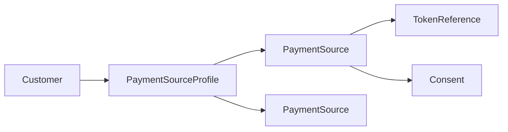
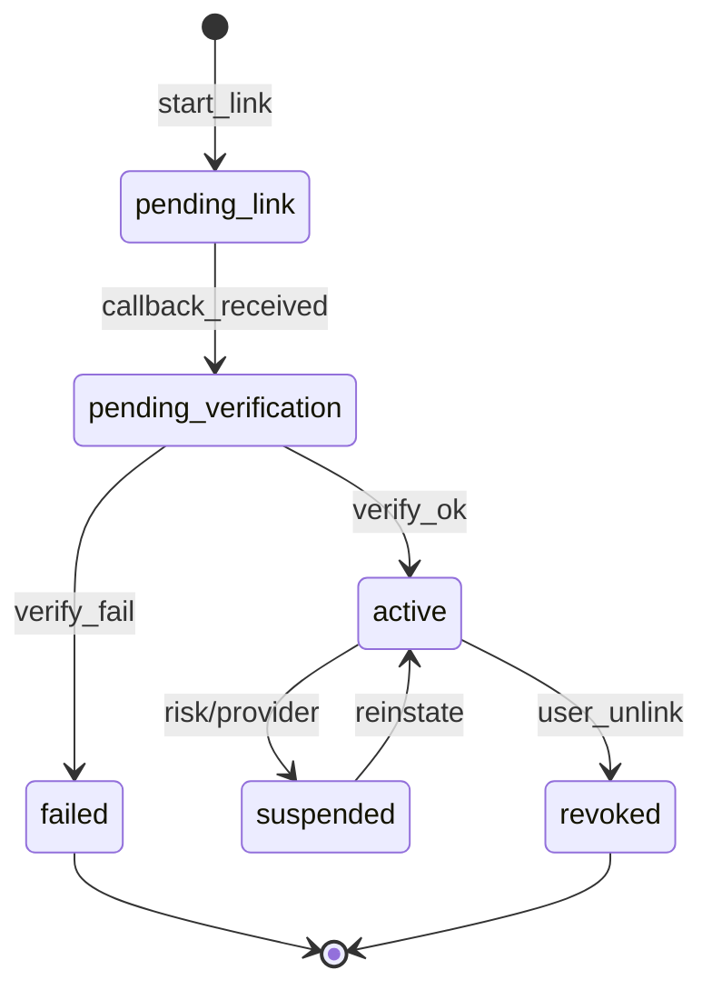
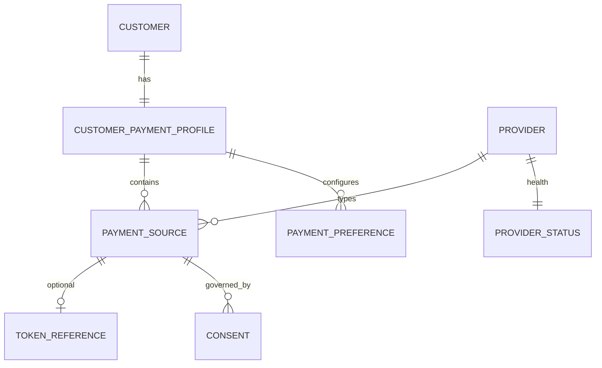

# 03 — Payment Source Model

**Bounded context:** `finance.payment_sources`

---

## Executive summary

Domain model for **PaymentSource** aggregates, customer profiles, preferences, limits, and lifecycle states—distinct from merchant identity (Phase 1) and payment intents (Phase 3).

---

## Business purpose

Ubiquitous language for engineering, APIs, and events.

---

## Architecture overview

---

## Aggregate: PaymentSource

| Field / concept | Description |
| --- | --- |
| `payment_source_id` | Stable Taifa reference for orchestrator |
| `customer_id` | Links to Identity user |
| `provider_id` | Registry key e.g. `mpesa_tz` |
| `type` | mobile_money, bank, card, corporate, gov |
| `display_mask` | e.g. `***1234` |
| `nickname` | User label |
| `status` | pending_verification, active, suspended, revoked |
| `is_default` | One default per profile (enforced) |
| `priority` | Sort order for failover prefs |
| `limits` | Optional per-source caps |
| `provider_instrument_ref` | Opaque PSP reference |
| `token_ref_id` | FK to vault for cards |

---

## State machine

---

## Customer payment profile

| Entity | Role |
| --- | --- |
| `CustomerPaymentProfile` | Container per `customer_id` |
| `PaymentPreference` | Default, priority list, failover config |
| `RecurringPermission` | Mandate metadata + consent_id |

---

## ER diagram

---

## API specifications

CRUD + lifecycle — [07_API_SPECIFICATION.md](07_API_SPECIFICATION.md).

---

## Domain events

`payment_source.linked`, `payment_source.verified`, etc. — [08_EVENT_CATALOG.md](08_EVENT_CATALOG.md).

---

## AWS architecture

RDS `payment_sources` schema; Redis for link session ephemeral state.

---

## Security considerations

Separate merchant vs customer scopes in JWT; ABAC on `customer_id`.

---

## Implementation strategy

Align IDs with future orchestrator: only `payment_source_id` crosses boundary.

---

## Future expansion

Household shared sources; corporate delegated cards.

---

## Cross-references

[04_TOKENIZATION.md](04_TOKENIZATION.md) · [05_CONSENT_MANAGEMENT.md](05_CONSENT_MANAGEMENT.md)
