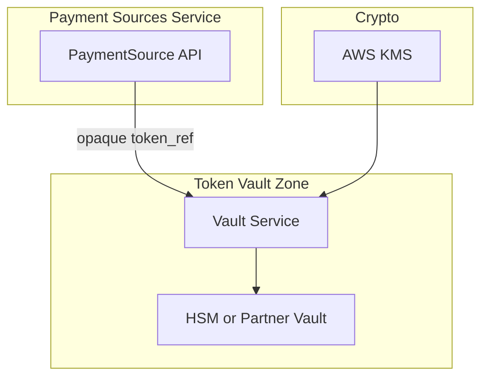
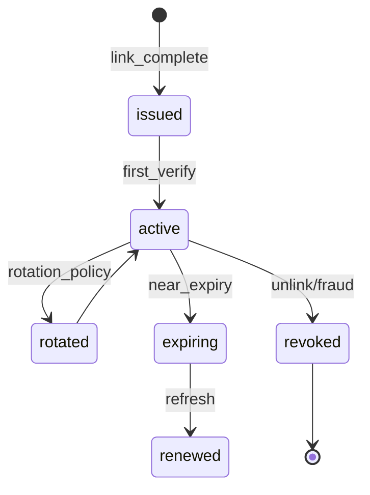
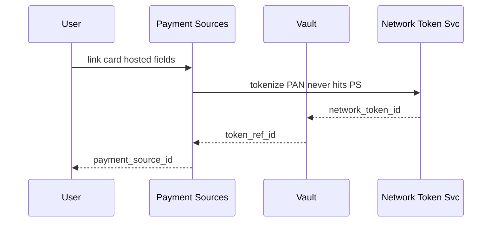

# 04 — Tokenization

---

## Executive summary

Secure **token lifecycle** for card and PSP references: storage, rotation, provider tokens vs internal references, PCI DSS boundaries, KMS encryption, expiration, and revocation—**no PAN/CVV in application tier**.

---

## Business purpose

Enable repeat use of linked instruments without re-exposing sensitive data.

---

## Architecture overview

---

## Token types

| Type | Stored where | Phase 2 |
| --- | --- | --- |
| `internal_ref` | Taifa RDS — encrypted blob or pointer | Mobile money MSISDN token from PSP |
| `network_token` | Vault / scheme | Visa/MC tokenization |
| `provider_token` | PSP only; Taifa stores handle | Daraja consent keys |

---

## Token lifecycle

---

## Sequence: card link tokenization

---

## PCI DSS considerations

| Zone | Scope |
| --- | --- |
| Payment Sources API (no PAN) | Out of CDE / SAQ A |
| Vault with PAN | **In CDE** — partner-hosted preferred |
| Logs | Never PAN; token_ref only |

---

## Key management

- CMK per environment `alias/tnpi/payment-sources`
- Secrets Manager for PSP API keys
- Annual key rotation drill

---

## Domain model

`TokenReference` — [09_DATABASE_MODEL.md](09_DATABASE_MODEL.md).

---

## API specifications

Tokens not exposed via public API—only `payment_source_id`.

---

## Domain events

`payment_source.updated` on rotation; audit on revoke.

---

## AWS architecture

Optional isolated `taifa-pci` account; PrivateLink to vault vendor.

---

## Security considerations

Token binding to `customer_id`; rate limit vault access.

---

## Implementation strategy

Prefer **hosted tokenization** for cards in Phase 2 MVP; vault partner RFP.

---

## Future expansion

L3 token domain controls; biometric binding.

---

## Cross-references

[10_SECURITY_MODEL.md](10_SECURITY_MODEL.md) · [17_COMPLIANCE_GUIDE.md](../17_COMPLIANCE_GUIDE.md)
