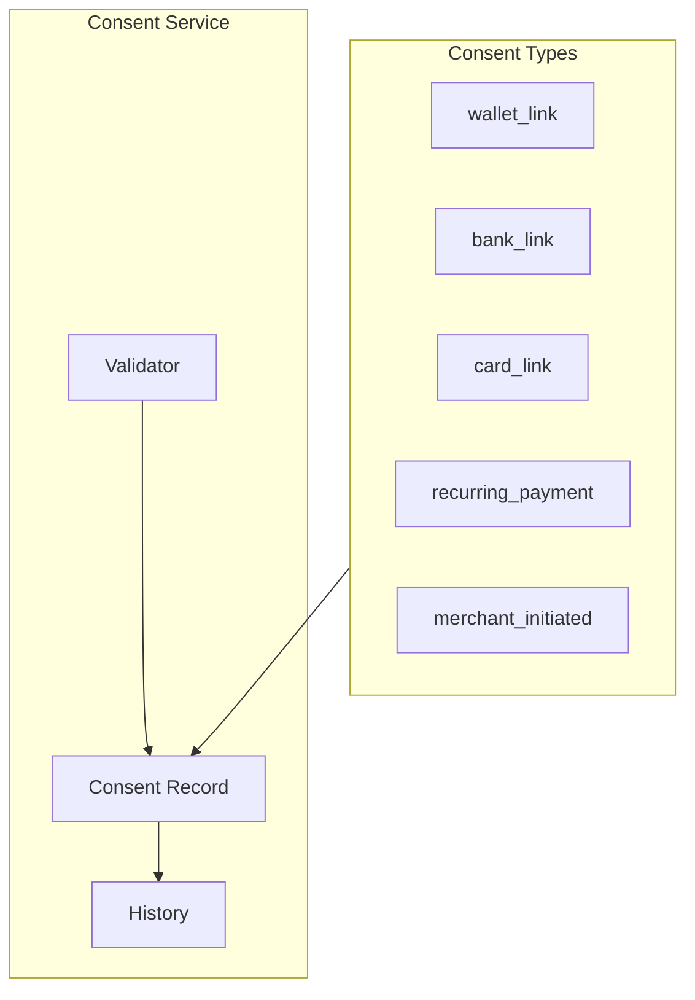
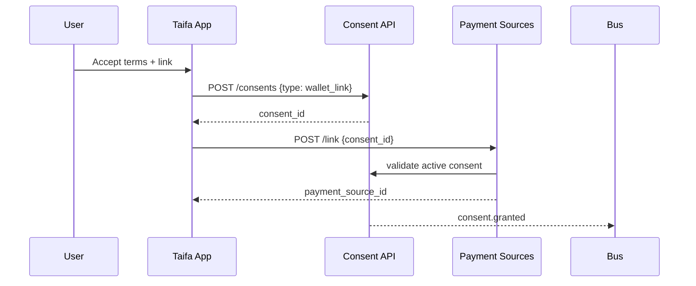

# 05 — Consent Management

---

## Executive summary

**Consent framework** for wallet linking, bank/card linking, recurring payments, MIT (merchant-initiated transactions), withdrawal, and auditable history—required for regulators and PSP agreements.

---

## Business purpose

Explicit user authorization is non-negotiable for national-scale linking.

---

## Architecture overview

---

## Consent record

| Field | Description |
| --- | --- |
| `consent_id` | UUID |
| `customer_id` | Subject |
| `type` | Enum per flow |
| `scope` | JSON — merchant_id, amount cap, frequency |
| `granted_at` | Timestamp |
| `expires_at` | Optional |
| `revoked_at` | Nullable |
| `evidence` | IP, device, auth method ref |

---

## Sequence: grant consent for link

---

## Withdrawal

User revokes → `consent.revoked` → cascade suspend `PaymentSource` → adapter `revoke_link` if supported.

---

## Domain model

`Consent` aggregate — [03_PAYMENT_SOURCE_MODEL.md](03_PAYMENT_SOURCE_MODEL.md).

---

## API specifications

| Method | Path |
| --- | --- |
| POST | `/api/v1/consents` |
| GET | `/api/v1/consents` |
| GET | `/api/v1/consents/{id}` |
| POST | `/api/v1/consents/{id}/revoke` |

---

## Domain events

`consent.granted`, `consent.revoked`

---

## AWS architecture

Append-only consent history table; WORM S3 for legal exports optional.

---

## Security considerations

Consent validation mandatory on link; MIT requires separate consent type.

---

## Implementation strategy

Version consent text; store `policy_version` on record.

---

## Future expansion

Granular scopes per vertical module.

---

## Cross-references

[07_API_SPECIFICATION.md](07_API_SPECIFICATION.md)
