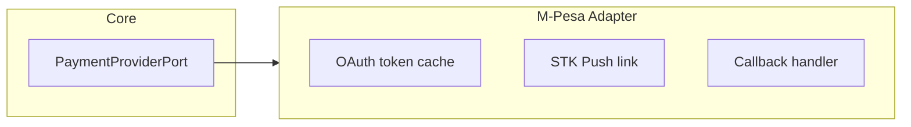
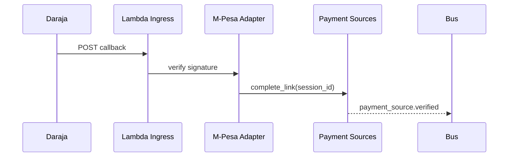

# 06 — Provider Adapters

---

## Executive summary

Per-PSP **adapter implementations** of `PaymentProviderPort`: authentication, link flows, verification, callbacks, error mapping, retries, timeouts, health checks, and versioning.

---

## Business purpose

Isolate messy PSP APIs from Taifa domain logic.

---

## Architecture overview

---

## Adapter responsibilities matrix

| Responsibility | Standard behavior |
| --- | --- |
| Authentication | OAuth/client creds; refresh in Secrets Manager |
| Authorization | User step-up via PSP UI |
| Balance check | Optional; degrade gracefully if unsupported |
| Payment initiation | **Phase 3** — stub throws `NotImplemented` in Phase 2 |
| Confirmation | Link completion only |
| Status updates | Webhook + poll for link session |
| Callbacks | Verify signature; idempotent handler |
| Error mapping | `provider_error_code` → `taifa_error` |
| Retries | Exponential backoff; idempotency keys |
| Timeouts | Per-method SLA table |
| Health | Synthetic `health_check` every 60s |
| Version | Semver in adapter manifest |

---

## Sequence: M-Pesa callback

---

## Provider-specific notes

| Provider | Link pattern | Callback |
| --- | --- | --- |
| M-Pesa | STK + C2B register | Daraja callback URL |
| Airtel | OAuth redirect | Webhook |
| Banks | OAuth2 + account picker | Redirect |
| Visa/MC | Token service | Async token status |

---

## Domain model

Uses `ProviderConfiguration` for endpoints, feature flags.

---

## API specifications

Internal admin: `PUT /internal/providers/{id}/config` (ops only).

---

## Domain events

Health flips → `provider.available` / `provider.unavailable`

---

## AWS architecture

Lambda for webhooks; SQS buffer; DLQ for poison messages.

---

## Security considerations

mTLS where PSP requires; IP allowlist on API GW resource policy.

---

## Implementation strategy

One adapter per repo module; certification checklist per PSP.

---

## Future expansion

Open Banking AIS/PIS adapters (Kenya, EU).

---

## Cross-references

[02_PROVIDER_ABSTRACTION.md](02_PROVIDER_ABSTRACTION.md)
