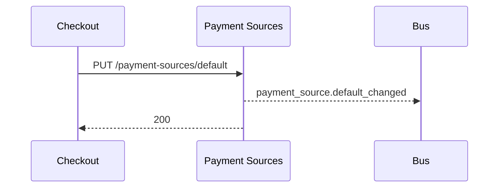

# 07 — API Specification (Payment Sources)

**Base path:** `/api/v1`  
**OpenAPI:** `tnpi-payment-sources-v1` (target)  
**Auth:** OIDC Bearer JWT (`customer_id` claim)

---

## Executive summary

Public REST API for linking, verifying, listing, and managing payment sources, consents, provider discovery, and health—**no charge endpoints**.

---

## Business purpose

Contract-first integration for mobile, web, and future orchestrator (read-only in Phase 2).

---

## Architecture overview

API Gateway → ECS `payment-sources-service` → RDS + Redis + adapters.

---

## Payment sources

| Method | Path | Description |
| --- | --- | --- |
| POST | `/payment-sources/link` | Start link (`provider_id`, `consent_id`) |
| POST | `/payment-sources/link/complete` | Complete redirect/callback session |
| POST | `/payment-sources/{id}/verify` | Re-verify ownership |
| DELETE | `/payment-sources/{id}` | Unlink / revoke |
| GET | `/payment-sources` | List for customer |
| GET | `/payment-sources/{id}` | Detail |
| PATCH | `/payment-sources/{id}` | Nickname, priority |
| POST | `/payment-sources/{id}/validate` | Pre-checkout validation |
| GET | `/payment-sources/default` | Get default |
| PUT | `/payment-sources/default` | Set default (`payment_source_id`) |

---

## Providers

| Method | Path | Description |
| --- | --- | --- |
| GET | `/payment-providers` | Discovery (enabled rails) |
| GET | `/payment-providers/{id}` | Capabilities + limits |
| GET | `/payment-providers/{id}/status` | Live health + incident |

---

## Consents

| Method | Path |
| --- | --- |
| POST | `/consents` |
| GET | `/consents` |
| GET | `/consents/{id}` |
| POST | `/consents/{id}/revoke` |

---

## Preferences

| Method | Path | Description |
| --- | --- | --- |
| GET | `/payment-preferences` | Priority order, failover |
| PUT | `/payment-preferences` | Update ordering |

---

## Customer profile

| Method | Path |
| --- | --- |
| GET | `/customers/me/payment-profile` |
| GET | `/customers/me/payment-profile/audit` | User-visible consent/source history |

---

## Sequence: set default at checkout

---

## Error model

| Code | HTTP | Meaning |
| --- | --- | --- |
| `source.verification_failed` | 422 | PSP verify failed |
| `source.validation_failed` | 422 | Limits / status |
| `consent.required` | 400 | Missing consent_id |
| `provider.unavailable` | 503 | Health gate |

---

## Domain events

Emitted post-commit — [08_EVENT_CATALOG.md](08_EVENT_CATALOG.md).

---

## AWS architecture

[11_AWS_ARCHITECTURE.md](11_AWS_ARCHITECTURE.md)

---

## Security considerations

Customer can only access own sources; rate limits on link attempts.

---

## Implementation strategy

Map legacy `/api/v1/wallets/*` → new paths with deprecation header.

---

## Future expansion

Orchestrator internal API `GET /internal/payment-sources/{id}` for Phase 3.

---

## Cross-references

[14_API_CATALOG.md](../14_API_CATALOG.md) — program-level index update when published
