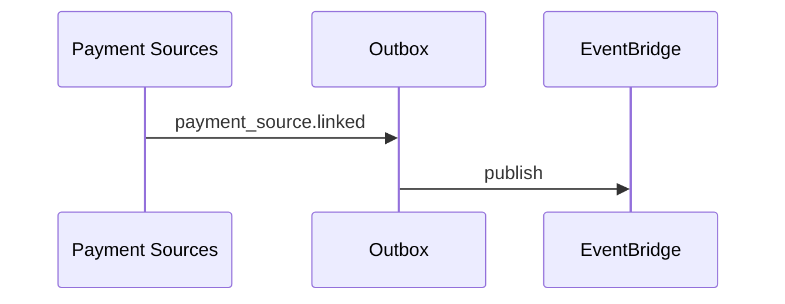

# 08 — Event Catalog (Payment Sources)

**Envelope:** [event-envelope-v1.json](../../platform/schemas/event-envelope-v1.json)  
**Prefix:** `payment_source.*`, `consent.*`, `provider.*`

---

## Executive summary

Enterprise events for instrument lifecycle, consent, and provider health—consumers: audit, notifications, risk (future), **Phase 3 orchestrator** (subscription only in Phase 2).

---

## Business purpose

Decouple payment source SoR from checkout and orchestration.

---

## Payment source events

| event_type | Payload (key fields) | Producer |
| --- | --- | --- |
| `payment_source.linked` | payment_source_id, provider_id, type, mask | Payment Sources |
| `payment_source.verified` | payment_source_id, verified_at | Payment Sources |
| `payment_source.unlinked` | payment_source_id, reason | Payment Sources |
| `payment_source.updated` | payment_source_id, changed[] | Payment Sources |
| `payment_source.default_changed` | customer_id, payment_source_id | Payment Sources |
| `payment_source.validation_failed` | payment_source_id, code | Payment Sources |

**Legacy alias:** `wallet.linked` → `payment_source.linked` (dual-publish during migration).

---

## Consent events

| event_type | Payload |
| --- | --- |
| `consent.granted` | consent_id, type, scope |
| `consent.revoked` | consent_id, revoked_at |

---

## Provider events

| event_type | Payload |
| --- | --- |
| `provider.available` | provider_id |
| `provider.unavailable` | provider_id, reason |

---

## Example: payment_source.linked

```json
{
  "event_type": "payment_source.linked",
  "tenant_id": "customer_uuid",
  "payload": {
    "payment_source_id": "uuid",
    "provider_id": "mpesa_tz",
    "display_mask": "2557****1234",
    "status": "pending_verification"
  }
}
```

---

## Sequence: publish after link



---

## Architecture / API / AWS

Standard Taifa Core event pipeline.

---

## Security considerations

No provider secrets in payload.

---

## Implementation strategy

JSON Schema per event in `docs/payments/payment-sources/schemas/` (future).

---

## Future expansion

`payment_source.limit_exceeded` for Phase 3 spend controls.

---

## Cross-references

[15_EVENT_CATALOG.md](../15_EVENT_CATALOG.md)
