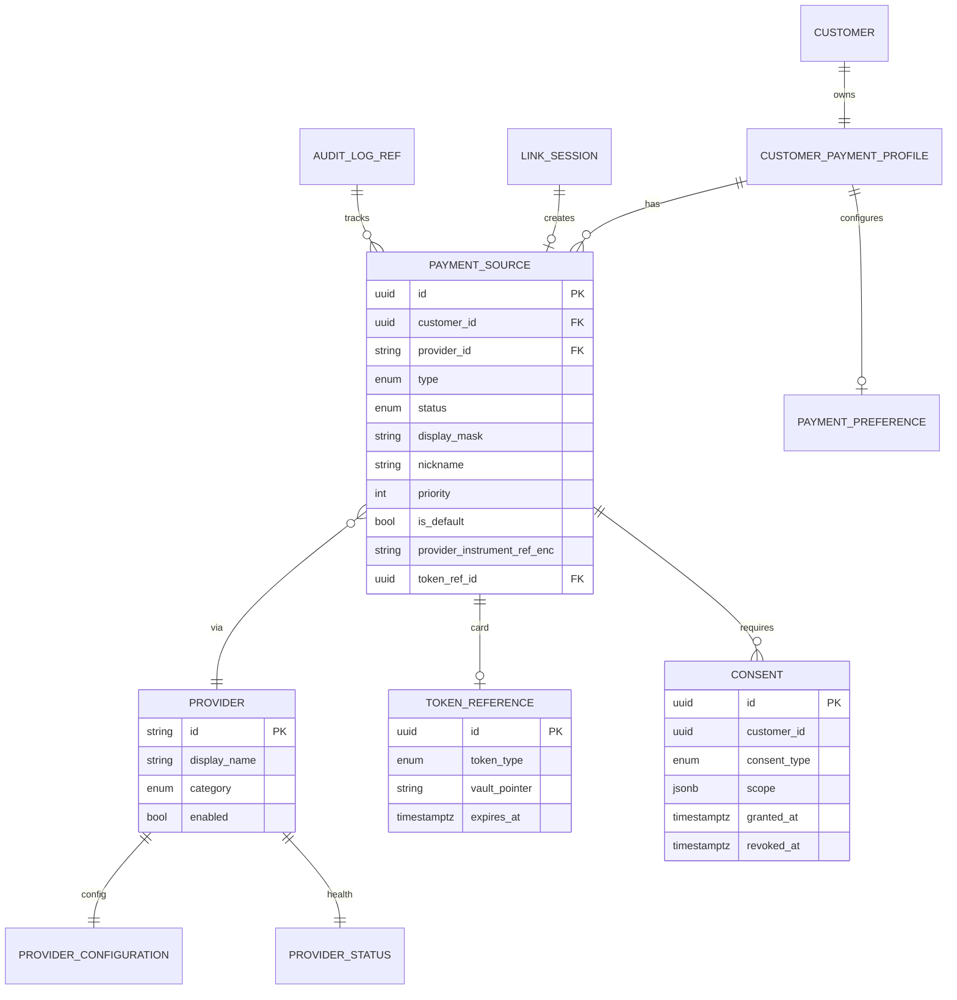

# 09 — Database Model

**Engine:** PostgreSQL 15+ · **Schema:** `payment_sources`

---

## Executive summary

Relational model for customers, payment sources, providers, tokens, consents, preferences, provider status, and audit references.

---

## Business purpose

Schema blueprint before migrations.

---

## ER diagram

---

## Indexes

| Table | Index |
| --- | --- |
| `payment_source` | `(customer_id, status)`, unique partial `(customer_id) WHERE is_default` |
| `link_session` | `(session_id)`, TTL purge |
| `consent` | `(customer_id, consent_type, revoked_at)` |

---

## Domain model mapping

[03_PAYMENT_SOURCE_MODEL.md](03_PAYMENT_SOURCE_MODEL.md)

---

## API / events / AWS

Backed by RDS in [11_AWS_ARCHITECTURE.md](11_AWS_ARCHITECTURE.md).

---

## Security considerations

Encrypt `provider_instrument_ref_enc` with KMS; hash MSISDN for dedup index optional.

---

## Implementation strategy

No FK to `merchant` schema; customer_id from Identity only.

---

## Future expansion

Sharding by customer_id hash at 50M+ users.

---

## Cross-references

[DATA_MODEL.md](../../DATA_MODEL.md)
