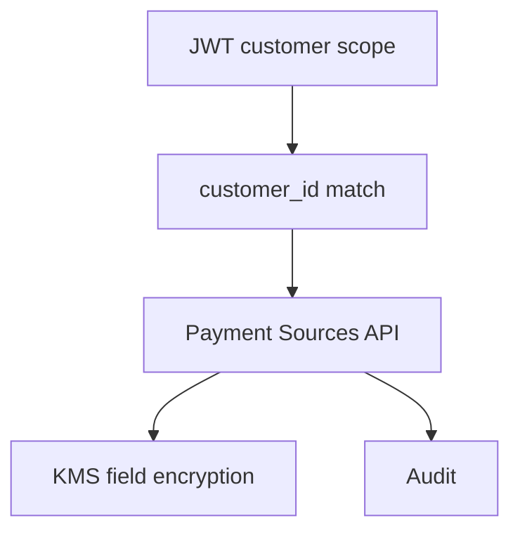

# 10 — Security Model

---

## Executive summary

OAuth2/OIDC, JWT, RBAC/ABAC, encryption, KMS, Secrets Manager, PCI readiness, consent validation, audit—for **customer payment data** and PSP credentials.

---

## Business purpose

Payment sources are high-value fraud targets.

---

## Architecture overview

---

## RBAC / ABAC

| Actor | Access |
| --- | --- |
| Customer | Own profile only |
| Support | Read with ticket + break-glass |
| Orchestrator (Phase 3) | `payment_source:read` scoped service role |
| Merchant | **No** access to customer sources |

---

## PCI DSS readiness

Card PAN never in Phase 2 app tier if hosted tokenization used; vault in CDE or partner.

---

## Consent validation

Mandatory on link; MIT consent separate; audit `consent_id` on every source.

---

## API / events / AWS

See sibling docs; WAF on link endpoints; bot control.

---

## Security considerations

Rate limit link; device binding optional; step-up auth for unlink.

---

## Implementation strategy

Annual pen test; gitleaks; dependency scan in CI.

---

## Future expansion

FIDO2 for high-value source changes.

---

## Cross-references

[10_SECURITY.md](../10_SECURITY.md)
