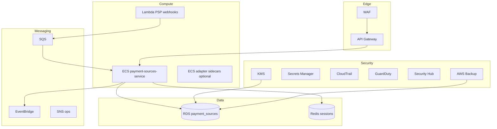
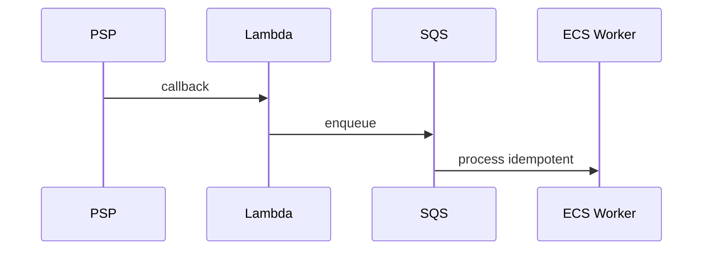

# 11 — AWS Architecture (Payment Sources)

**Region:** `af-south-1`

---

## Executive summary

Production topology: API Gateway, ECS Fargate (payment-sources + adapter workers), Lambda (webhooks), RDS, Redis, EventBridge, SQS, SNS, observability, security services.

---

## Business purpose

Highly available linking workloads with burst traffic during campaigns.

---

## Component diagram

---

## Sequence: webhook ingestion

---

## Scaling

| Component | Policy |
| --- | --- |
| ECS | CPU target 60%; min 3 prod |
| Redis | Session TTL 15m link flows |
| RDS | Read replica for list APIs |

---

## API / events / security

Per [07](07_API_SPECIFICATION.md), [08](08_EVENT_CATALOG.md), [10](10_SECURITY_MODEL.md).

---

## Implementation strategy

Terraform module `tnpi-payment-sources`; reuse Core VPC.

---

## Future expansion

Multi-region active-passive for East Africa.

---

## Cross-references

[11_AWS_ARCHITECTURE.md](../11_AWS_ARCHITECTURE.md)
