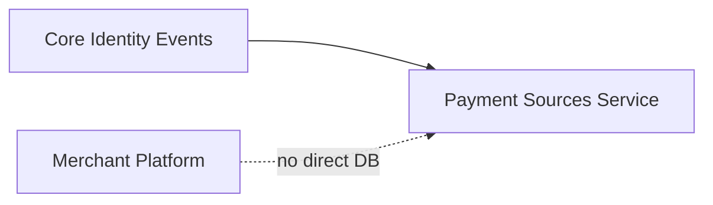
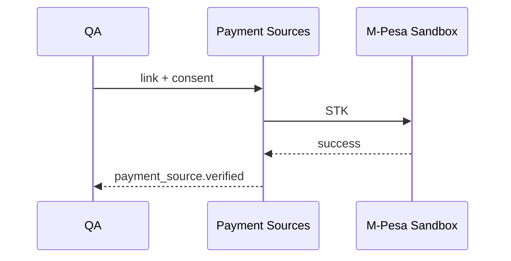

# 12 — Implementation Guide

---

## Executive summary

Implement Payment Sources as TNPI Phase 2 on Taifa Core, after Merchant Platform gate—adapters for M-Pesa first, then Airtel, banks, cards—**no charge/settlement/recon/SoftPOS/QR**.

---

## Business purpose

Executable plan for squads.

---

## Architecture overview

Orchestrator **not deployed** in Phase 2; optional read-only consumer in staging tests only.

---

## Strangler from legacy

| Legacy | Target |
| --- | --- |
| `POST /wallets/link` | `/payment-sources/link` |
| Mobile `features/wallet/` link UI | New payment sources client SDK |
| `PaymentGateway.charge` | **Unchanged** until Phase 3 |

Feature flag: `tnpi.payment_sources.platform`.

---

## Engineering stages

| Stage | Weeks | Focus |
| --- | --- | --- |
| PS-0 | 2 | OpenAPI, schema, port interface |
| PS-1 | 4 | Consent + link session + M-Pesa adapter |
| PS-2 | 3 | Verify, unlink, list, default |
| PS-3 | 3 | Airtel + second MM adapter |
| PS-4 | 3 | Bank OAuth adapter stub |
| PS-5 | 3 | Card tokenization partner integration |
| PS-6 | 2 | Provider health + preferences |
| PS-7 | 2 | Hardening, pen test, gate |

---

## Sequence: first staging link

---

## API / events / DB / AWS

Per docs 07–11.

---

## Security considerations

Gate each stage with threat model.

---

## Implementation strategy

Contract tests per adapter; sandbox PSP credentials in Secrets Manager.

---

## Dependencies

[PHASE2_GATE_PACKAGE.md](PHASE2_GATE_PACKAGE.md) dependency graph.

---

## Future expansion

Phase 3 orchestrator consumes `payment_source_id` only.

---

## Cross-references

[14_BACKLOG.md](14_BACKLOG.md)
