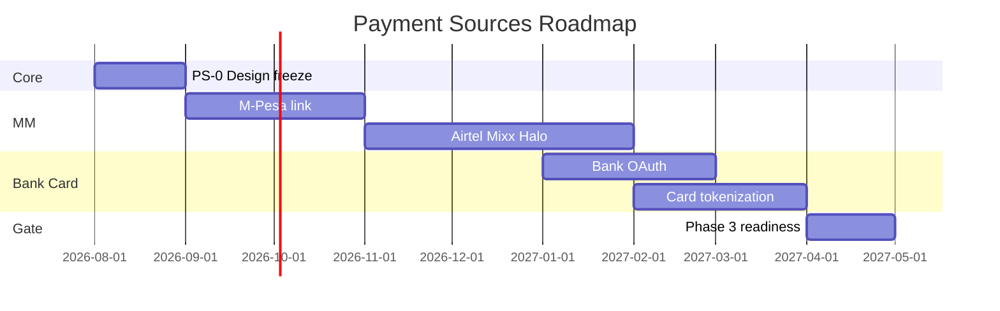

# 13 — Roadmap

---

## Executive summary

Phase 2 roadmap Q3 2026 – Q2 2027: adapters rollout and national link coverage.

---

## Business purpose

Stakeholder communication.

---

## Gantt

---

## Milestones

| ID | Outcome |
| --- | --- |
| PS-M1 | M-Pesa link in staging |
| PS-M2 | 3 MM providers linkable |
| PS-M3 | Card token live sandbox |
| PS-M4 | Provider health dashboard |
| PS-M5 | Phase 3 gate sign-off |

---

## Architecture / API / events / AWS / security / implementation

See [12_IMPLEMENTATION_GUIDE.md](12_IMPLEMENTATION_GUIDE.md).

---

## Future expansion

Kenya/Uganda providers; CBDC pilot adapter interface.

---

## Cross-references

[13_PAYMENT_ROADMAP.md](../13_PAYMENT_ROADMAP.md)
