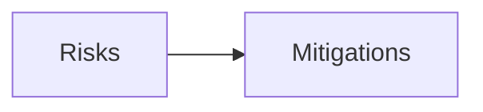

# 17 — Risk Register

---

## Executive summary

Phase 2 payment sources risks.

---

## Business purpose

Program governance.

---

## Risks

| ID | Risk | L | I | Pri | Mitigation |
| --- | --- | --- | --- | --- | --- |
| SR-01 | PSP API change breaks adapters | H | M | P1 | Versioned adapters, contract tests |
| SR-02 | Stolen link session | M | H | P1 | Short TTL, binding, step-up |
| SR-03 | Consent not legally sufficient | M | H | P1 | Legal review of copy + evidence |
| SR-04 | PAN leakage | L | H | P1 | Hosted tokenization only |
| SR-05 | Customer blames Taifa for PSP outage | H | M | P2 | Clear UX + provider status |
| SR-06 | Phase 3 scope creep into Phase 2 | H | M | P1 | AC-A1 architecture review |
| SR-07 | Duplicate wallet + payment_source | M | M | P2 | Strangler + deprecation |
| SR-08 | MM sandbox unavailable | M | M | P2 | Recorded stubs for CI |
| SR-09 | Cross-border data residency | L | M | P3 | Legal per country |

---

## Architecture

---

## API / events / AWS / security / implementation

Review monthly PS-1–PS-7.

---

## Future expansion

Merge with [18_RISK_REGISTER.md](../18_RISK_REGISTER.md).

---

## Cross-references

[PHASE2_GATE_PACKAGE.md](PHASE2_GATE_PACKAGE.md)
