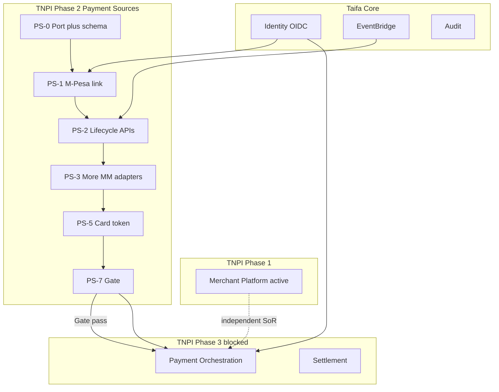

# TNPI Phase 2 — Gate Package (Payment Sources Platform)

**Status:** Planning complete — implementation may proceed after Merchant Phase 1 production gate (assumed **approved** per program)  
**Date:** 2026-08-06

---

## 1. Product Readiness Report

### Executive summary

The **Payment Sources Platform** pack (`docs/payments/payment-sources/00–17`) defines TNPI Phase 2: national **instrument linking, consent, token references, and provider abstraction**—Apple Wallet–class UX for Tanzania—**without** payment processing, settlement, reconciliation, SoftPOS, or QR.

### Readiness matrix

| Dimension | Status |
| --- | --- |
| Product vision & provider abstraction | ✅ |
| Domain, tokenization, consent | ✅ |
| Adapters specification | ✅ |
| APIs & events | ✅ |
| Data, security, AWS | ✅ |
| Implementation guide, backlog, acceptance | ✅ |
| Risks | ✅ |
| **Implementation code** | ⬜ |
| **M-Pesa sandbox link in staging** | ⬜ |
| **Merchant Phase 1 gate evidence** | ✅ assumed approved |

### Verdict

| Question | Answer |
| --- | --- |
| Ready to **start Phase 2 implementation**? | **Yes** (architecture) |
| Ready for **Phase 3 orchestration**? | **No** — complete §4 exit criteria |

### Sign-off (post-implementation)

| Role | Date |
| --- | --- |
| TNPI Product Lead | |
| Security | |
| Platform Engineering | |

---

## 2. Dependency Graph

**External:** Safaricom Daraja, Airtel APIs, card tokenization partner, legal consent templates.

**Not required for Phase 2:** Merchant `active` for customer link (consumer path), but orchestration later needs both merchant + source.

---

## 3. Sprint Plan

| Sprint | Duration | Goals | Backlog |
| --- | --- | --- | --- |
| **PS-0** | 2 wk | Port interface, OpenAPI, RDS schema | PSB-001–002 |
| **PS-1** | 4 wk | Consent, sessions, M-Pesa adapter | PSB-003–005 |
| **PS-2** | 3 wk | CRUD lifecycle, default, events, profile | PSB-006–010, 017 |
| **PS-3** | 3 wk | Airtel + Mixx/Halo | PSB-011–012, 014 |
| **PS-4** | 3 wk | Bank OAuth MVP | PSB-015 |
| **PS-5** | 3 wk | Card tokenization | PSB-016 |
| **PS-6** | 2 wk | Health, preferences, failover config | PSB-013, PSB-031 |
| **PS-7** | 2 wk | Load test, security, gate | PSB-018–020 |

Detail: [14_BACKLOG.md](14_BACKLOG.md) · [12_IMPLEMENTATION_GUIDE.md](12_IMPLEMENTATION_GUIDE.md).

---

## 4. Exit Criteria — TNPI Phase 3 (Payment Orchestration Platform)

Phase 3 per [03_PAYMENT_ORCHESTRATION.md](../03_PAYMENT_ORCHESTRATION.md) may start when:

| # | Criterion |
| --- | --- |
| E1 | All [15_ACCEPTANCE_CRITERIA.md](15_ACCEPTANCE_CRITERIA.md) **AC-F, AC-N, AC-S, AC-A** passed in staging |
| E2 | Phase 2 gate package **signed** (§1) |
| E3 | ≥ **2** mobile money providers + **1** of (bank OAuth **or** card token) linkable in staging |
| E4 | `payment_source_id` contract frozen for orchestrator input |
| E5 | Consent + audit evidence sample approved by Compliance |
| E6 | Provider health monitor operational with SNS alerts |
| E7 | No open **P1** in [17_RISK_REGISTER.md](17_RISK_REGISTER.md) without ADR waiver |
| E8 | **Verified exclusion:** no charge/capture/settlement/reconciliation/SoftPOS/QR processing deployed |
| E9 | ADR published: orchestrator **only** references sources via API/events, never PSP credentials directly |
| E10 | Merchant Platform Phase 1 gate remains valid (merchants can be activated for pilot orchestration) |

---

## Cross-references

[00_INDEX.md](00_INDEX.md) · [merchant/PHASE1_GATE_PACKAGE.md](../merchant/PHASE1_GATE_PACKAGE.md)
