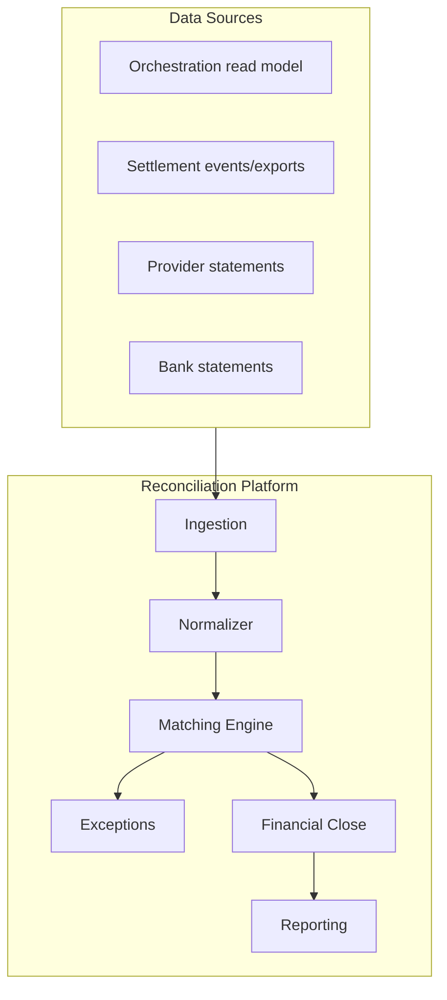
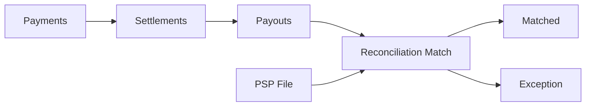

# 01 — Product Vision

---

## Executive summary

Taifa **Reconciliation Platform** (Phase 6): enterprise verification of millions of financial records daily—payments through settlements and payouts—matching TNPI to PSP/bank truth with exceptions, closing, and audit-grade reporting.

---

## Business purpose

Treasury, finance, and regulators require provable accuracy; reconciliation is the verification layer.

---

## Architecture overview

---

## Product vision

**Every shilling verified—automatically matched, exceptions resolved, books closed with confidence.**

---

## Reconciliation domains

| Domain | Internal | External |
| --- | --- | --- |
| Payments | `payment_id`, attempts | PSP transaction files |
| Settlements | `settlement_id`, batches | — |
| Payouts | `payout_id`, attempts | B2C / bank confirmations |
| Refunds | refund records | PSP reversal lines |
| Chargebacks | dispute records | acquirer files |
| Fees/commissions/tax | settlement items | contractual schedules |
| Government | remittance lines | agency reports |

---

## Financial flow diagram

---

## Capability model

Transaction/settlement/payout/refund/chargeback/fee/commission/tax/provider/merchant recon · daily/batch/scheduled/real-time · exceptions · adjustments · closing · reports.

---

## Security / AWS / observability / implementation

[10](10_SECURITY_MODEL.md) · [11](11_AWS_ARCHITECTURE.md) · [12](12_OBSERVABILITY.md) · [13](13_IMPLEMENTATION_GUIDE.md)

---

## Operational considerations

Finance ops L1/L2; SLA for exception resolution; freeze windows during close.

---

## Future expansion

Cross-border multi-currency recon; CBDC statements.

---

## Cross-references

[PHASE6_GATE_PACKAGE.md](PHASE6_GATE_PACKAGE.md)
