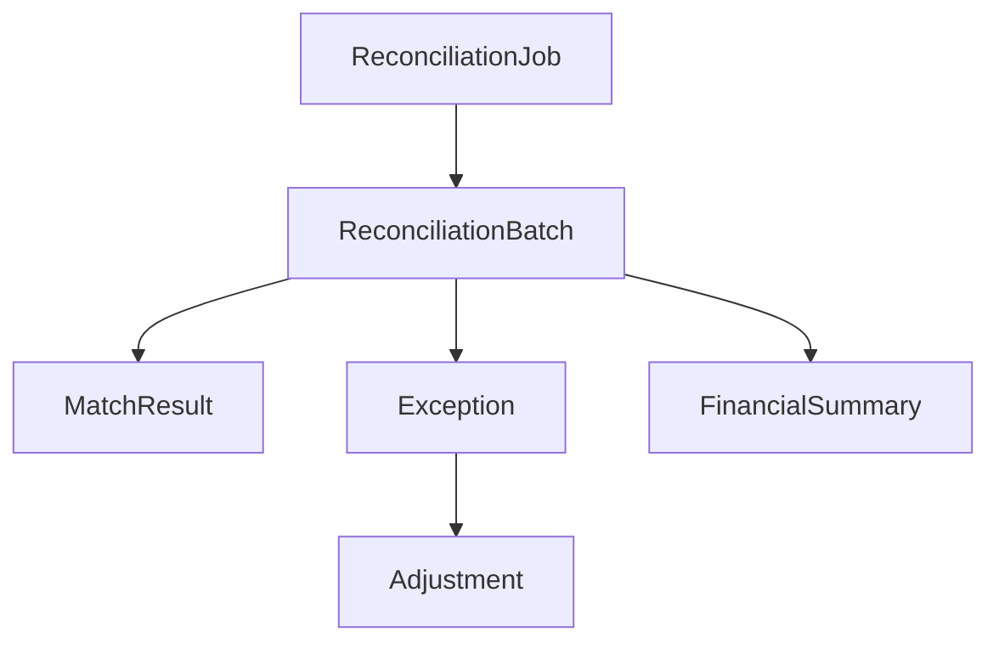
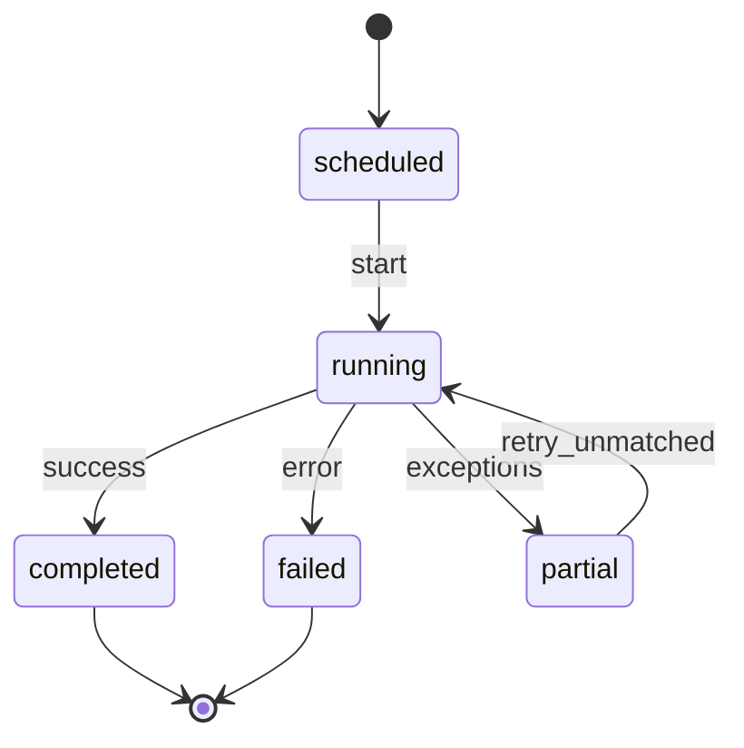
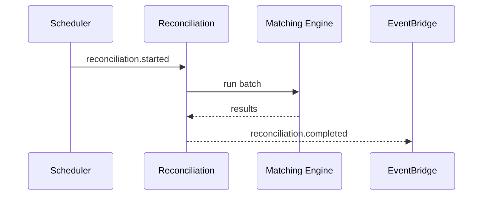

# 02 — Reconciliation Model

**Bounded context:** `finance.reconciliation`

---

## Executive summary

Domain model for **ReconciliationJob**, batches, match results, exceptions, adjustments, statements, closing periods, audit records.

---

## Business purpose

Ubiquitous language for finance engineering and auditors.

---

## Architecture overview

---

## Job types

| Type | Scope |
| --- | --- |
| `payment_provider` | PSP vs orchestration |
| `settlement_internal` | Settlement vs payments |
| `payout_provider` | Payout vs PSP |
| `merchant_statement` | Merchant view vs internal |
| `daily_close` | Period rollup |
| `government` | Agency collections |

---

## State machine (job)

---

## Sequence: scheduled daily job

---

## ER overview

See [09_DATABASE_MODEL.md](09_DATABASE_MODEL.md).

---

## API / events

[07](07_API_SPECIFICATION.md) · [08](08_EVENT_CATALOG.md)

---

## Security

Read-only on orchestration/settlement SoR; writes only recon schema + approved adjustments.

---

## AWS

Batch jobs Step Functions.

---

## Implementation strategy

Versioned recon rules per provider format.

---

## Future expansion

Continuous recon streams.

---

## Cross-references

[settlement/PHASE5_GATE_PACKAGE.md](../settlement/PHASE5_GATE_PACKAGE.md) export schema
