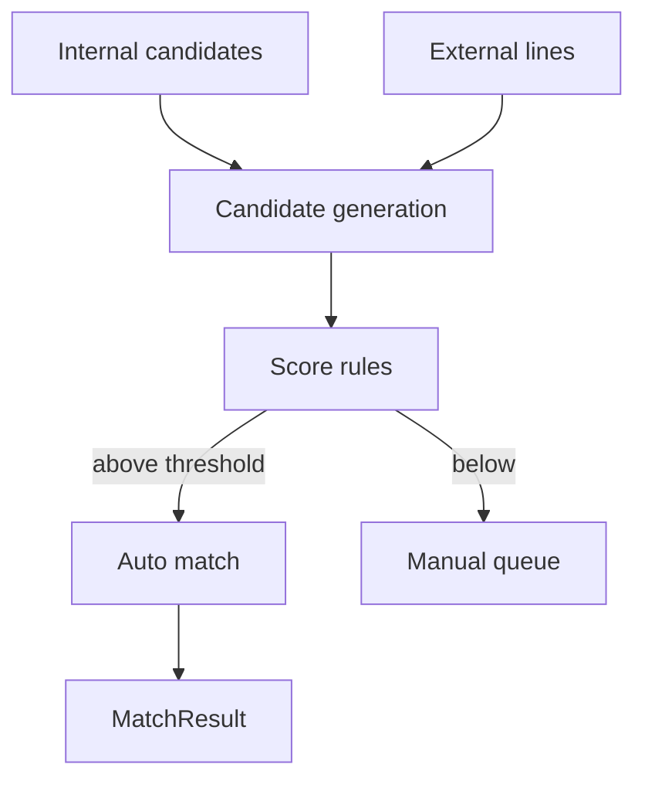
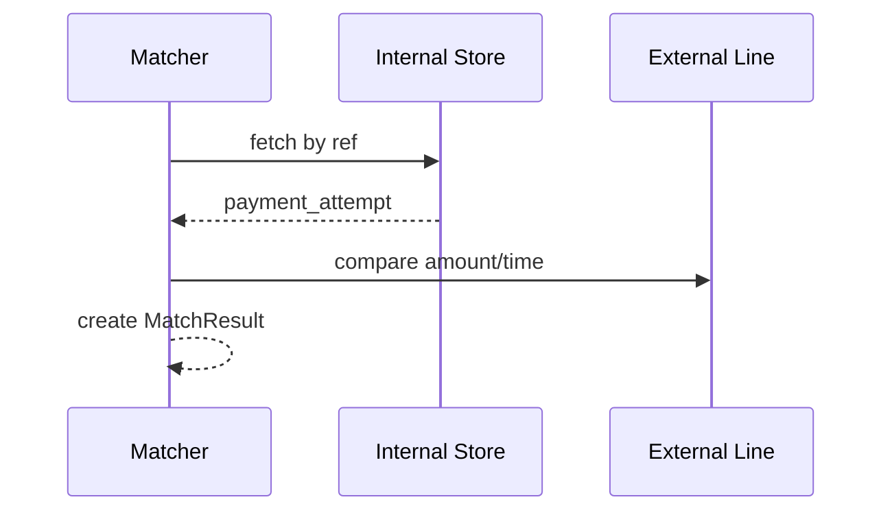

# 03 — Matching Engine

---

## Executive summary

Sophisticated **matching engine**: 1:1, 1:N, N:1, partial, tolerance, time windows, amount/reference/fingerprint matching, auto + manual.

---

## Business purpose

Core technical differentiator for financial accuracy at scale.

---

## Matching flow diagram

---

## Match strategies

| Strategy | Use |
| --- | --- |
| One-to-one | `provider_ref` = `payment_attempt.provider_ref` |
| One-to-many | Single PSP line → multiple micro-payments |
| Many-to-one | Batch deposit vs many payouts |
| Partial | Amount tolerance ±X TZS |
| Time window | ±15 min timestamp |
| Fingerprint | Hash(amount, msisdn_mask, terminal) |
| Reference | `conversation_id`, `receipt_no` |

---

## Tolerance rules

| Rule | Config |
| --- | --- |
| Amount | `abs(delta) <= tolerance` |
| Currency | Must match unless FX job |
| Timing | `|t_int - t_ext| <= window` |

---

## Sequence: auto match

---

## API / events / DB

Manual match API updates `MatchResult` + resolves exception.

---

## AWS

ECS workers; Redis candidate index; optional OpenSearch for fuzzy ref.

---

## Security

No mutation of payment/settlement SoR from matcher.

---

## Operational considerations

Match rate KPI ≥ 98% target staging.

---

## Implementation strategy

Pluggable `MatchRule` chain per provider.

---

## Future expansion

ML-assisted fuzzy matching with human review.

---

## Cross-references

[04_EXCEPTION_MANAGEMENT.md](04_EXCEPTION_MANAGEMENT.md)
