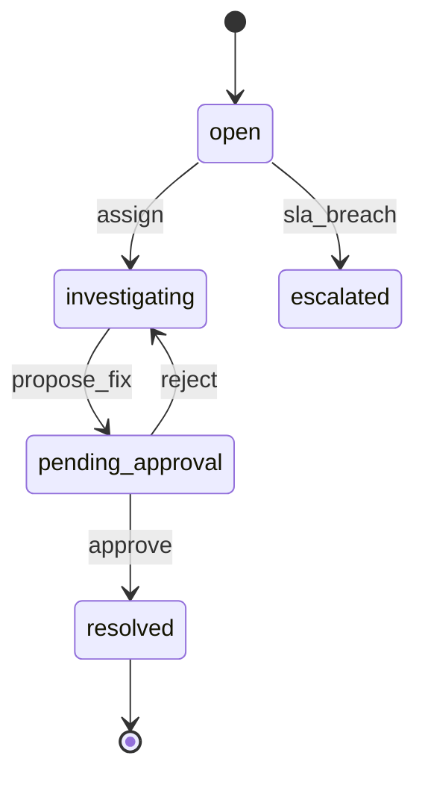
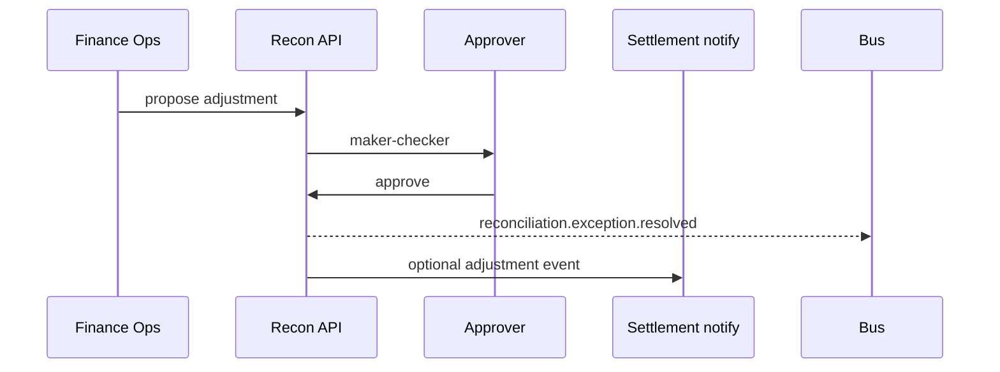

# 04 — Exception Management

---

## Executive summary

**Exception** lifecycle: missing, duplicate, amount/timing/currency mismatch, provider failures, escalation, resolution, dashboard.

---

## Business purpose

Human-in-the-loop for what automation cannot safely resolve.

---

## Architecture

---

## Exception types

| Type | Description |
| --- | --- |
| `missing_internal` | PSP line, no TNPI row |
| `missing_external` | TNPI row, no PSP line |
| `duplicate` | Multiple matches |
| `amount_mismatch` | Over tolerance |
| `timing_mismatch` | Outside window |
| `settlement_mismatch` | Batch totals differ |
| `provider_failure` | File incomplete |

---

## Sequence: resolution with adjustment

---

## Dashboard

Queues by type, age, provider, amount; SLA heatmap.

---

## API / events / security

Segregation: investigator ≠ approver.

---

## AWS

SQS per priority; SNS escalation.

---

## Implementation strategy

Link adjustment to settlement only via approved API—not direct SQL.

---

## Future expansion

Auto-resolve low-value tolerances with policy ADR.

---

## Cross-references

[07_API_SPECIFICATION.md](07_API_SPECIFICATION.md)
