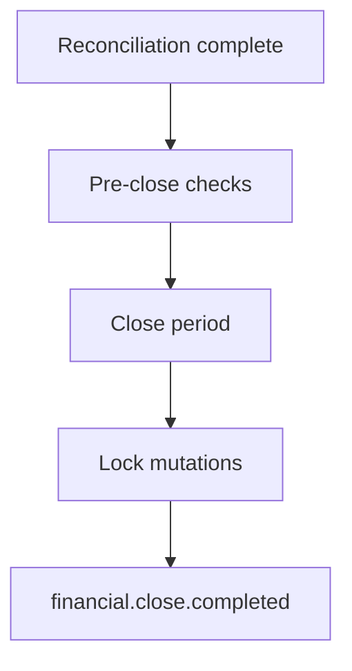
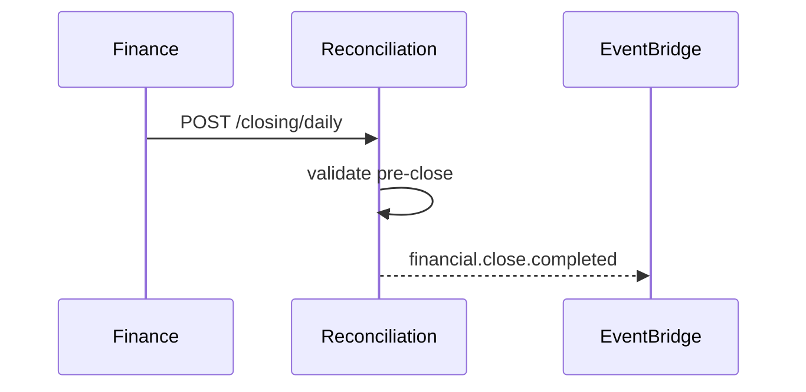

# 05 — Financial Closing

---

## Executive summary

**Daily, weekly, monthly, year-end** closing for merchant, provider, government; freeze periods; `financial.close.completed`.

---

## Business purpose

Controlled books for treasury and audit.

---

## Architecture

---

## Closing periods

| Period | `ClosingPeriod` type |
| --- | --- |
| Daily | EAT business date |
| Weekly | ISO week |
| Monthly | Calendar month |
| Year-end | Fiscal year |

---

## Pre-close checks

| Check | Rule |
| --- | --- |
| Open exceptions | Zero P1 or waived |
| Unmatched % | Below threshold |
| Settlement batch | All batches `completed` or explained |

---

## Sequence: daily close

---

## API / events / DB

`ClosingPeriod` entity — [09](09_DATABASE_MODEL.md)

---

## Security

Only `finance.controller` role closes period.

---

## AWS

Scheduled EventBridge rules.

---

## Operational considerations

Rollback close = ADR + controller approval only.

---

## Implementation strategy

Start daily provider close; add merchant monthly.

---

## Future expansion

Continuous close for real-time recon tier.

---

## Cross-references

[06_REPORTING.md](06_REPORTING.md)
