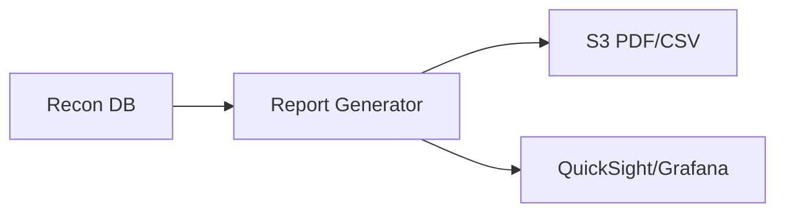
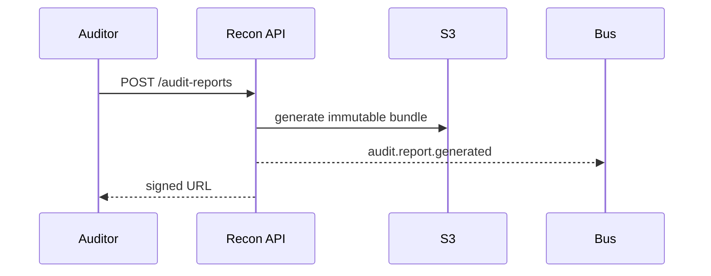

# 06 — Reporting

---

## Executive summary

Merchant, finance, treasury, government, audit, compliance, executive and operational dashboards.

---

## Business purpose

Transparency and regulatory evidence.

---

## Report catalog

| Report | Audience |
| --- | --- |
| Merchant reconciliation summary | Merchants |
| Provider variance | Finance |
| Treasury cash movement | Treasury |
| Government collection | Agencies |
| Audit trail export | Auditors |
| Compliance (BoT) | Compliance |
| Executive KPI | Leadership |
| Ops exception aging | Finance ops |

---

## Architecture

---

## Sequence: audit report

---

## API / events / security

WORM or versioning on audit bundles; PII redaction rules.

---

## AWS

Athena on curated S3; Glue catalog optional.

---

## Implementation strategy

Report templates versioned.

---

## Future expansion

XBRL export.

---

## Cross-references

[07_API_SPECIFICATION.md](07_API_SPECIFICATION.md)
