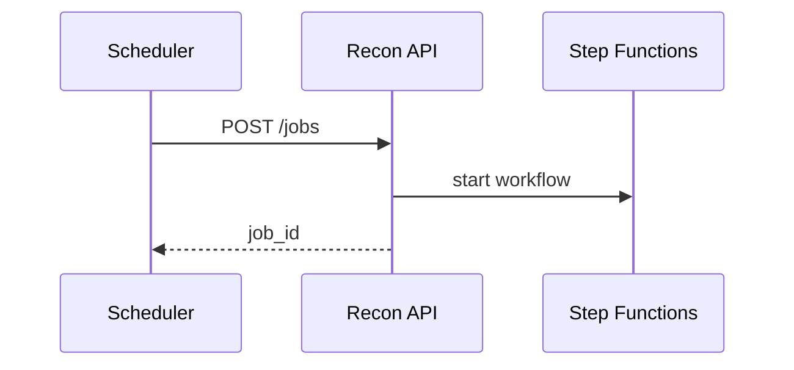

# 07 — API Specification

**Base:** `/api/v1/reconciliation`

---

## Executive summary

Reconciliation control, exception, report, and adjustment APIs.

---

## Jobs & status

| Method | Path |
| --- | --- |
| POST | `/reconciliation/jobs` | Start (type, period, provider) |
| GET | `/reconciliation/jobs/{id}` |
| GET | `/reconciliation/jobs` |
| POST | `/reconciliation/jobs/{id}/cancel` |

---

## Exceptions

| Method | Path |
| --- | --- |
| GET | `/exceptions` | Search/filter |
| GET | `/exceptions/{id}` |
| POST | `/exceptions/{id}/assign` |
| POST | `/exceptions/{id}/resolve` |
| POST | `/exceptions/{id}/escalate` |
| POST | `/exceptions/{id}/manual-match` |

---

## Adjustments

| Method | Path |
| --- | --- |
| POST | `/adjustments` | Maker |
| POST | `/adjustments/{id}/approve` | Checker |

---

## Reports

| Method | Path |
| --- | --- |
| GET | `/reports/merchant/{merchant_id}` |
| GET | `/reports/provider/{provider_id}` |
| GET | `/reports/finance/daily` |
| GET | `/reports/treasury` |
| POST | `/audit-reports` |

---

## Closing

| Method | Path |
| --- | --- |
| POST | `/closing/daily` |
| POST | `/closing/monthly` |
| GET | `/closing/periods` |

---

## Sequence: start reconciliation

---

## Events / DB / security / AWS

[08](08_EVENT_CATALOG.md) · finance roles only · internal admin routes.

---

## Implementation strategy

OpenAPI `tnpi-reconciliation-v1`.

---

## Future expansion

Merchant self-service read-only recon portal.

---

## Cross-references

[settlement/06_API_SPECIFICATION.md](../settlement/06_API_SPECIFICATION.md)
