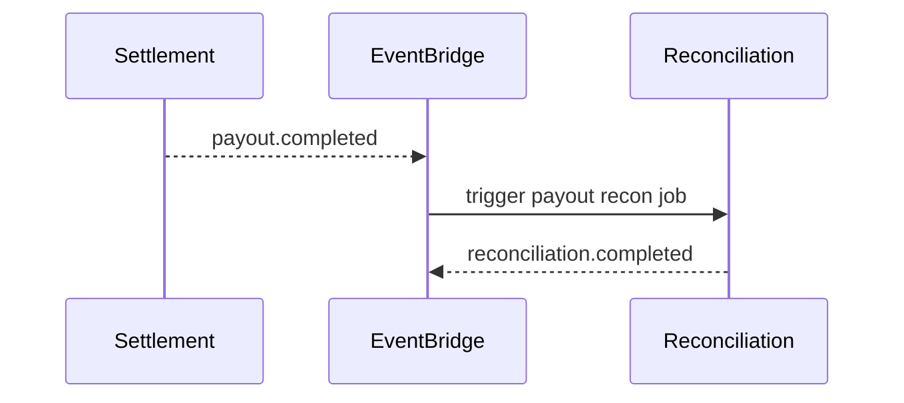

# 08 — Event Catalog

**Prefix:** `reconciliation.*`, `financial.close.*`, `audit.report.*`

---

## Executive summary

Reconciliation events; consumes settlement/orchestration facts (read/subscribe).

---

## Inbound (subscribe)

| event_type | Use |
| --- | --- |
| `payment.completed` | Payment recon staging |
| `settlement.completed` | Settlement recon |
| `payout.completed` | Payout recon |
| `payment.refunded` | Refund recon |

---

## Outbound

| event_type | When |
| --- | --- |
| `reconciliation.started` | Job start |
| `reconciliation.completed` | Job success |
| `reconciliation.failed` | Job fail |
| `reconciliation.exception.detected` | New exception |
| `reconciliation.exception.resolved` | Closed exception |
| `reconciliation.manual.adjustment` | Approved adjustment |
| `financial.close.completed` | Period closed |
| `audit.report.generated` | Report ready |

---

## Sequence

---

## Security / observability

No card data in events.

---

## Implementation strategy

Idempotent job processing per `(job_type, period, provider)`.

---

## Future expansion

`reconciliation.realtime.matched`

---

## Cross-references

[15_EVENT_CATALOG.md](../15_EVENT_CATALOG.md)
