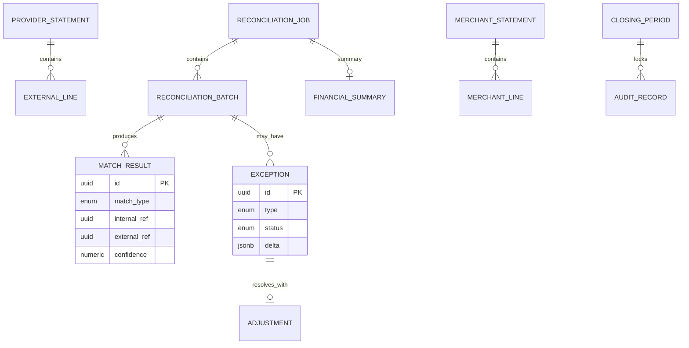

# 09 — Database Model

**Schema:** `reconciliation`

---

## Executive summary

ER for jobs, batches, matches, exceptions, adjustments, statements, summaries, audit, closing.

---

## ER diagram

---

## Read models

Replica or API read from orchestration/settlement—**no FK** across bounded contexts; store `payment_id`, `settlement_id`, `payout_id` UUIDs only.

---

## API / events / security

Immutable `audit_record` append-only.

---

## AWS

RDS; S3 for statement files; lifecycle to Glacier.

---

## Implementation strategy

Partition `external_line` by statement date.

---

## Future expansion

Data warehouse star schema export.

---

## Cross-references

[02_RECONCILIATION_MODEL.md](02_RECONCILIATION_MODEL.md)
