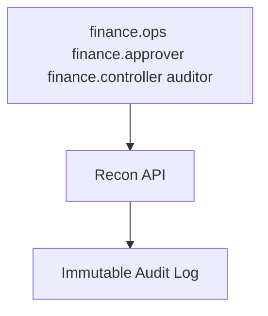

# 10 — Security Model

---

## Executive summary

Maker-checker, RBAC financial access, segregation of duties, immutable audit, encryption, KMS, compliance logging, integrity controls.

---

## Business purpose

Reconciliation is fraud-sensitive; insider threat controls mandatory.

---

## Architecture

---

## Controls

| Control | Detail |
| --- | --- |
| SoD | Matcher ≠ approver ≠ closer |
| RBAC | Merchant sees own reports only |
| Adjustments | Dual control |
| Logs | Append-only, hash chain optional |
| Encryption | RDS + S3 KMS |
| Compliance | Retention 7+ years policy |

---

## API / AWS / observability

GuardDuty; CloudTrail data events on S3 statements.

---

## Implementation strategy

Annual access review.

---

## Future expansion

External auditor read-only role with MFA.

---

## Cross-references

[17_COMPLIANCE_GUIDE.md](../17_COMPLIANCE_GUIDE.md)
