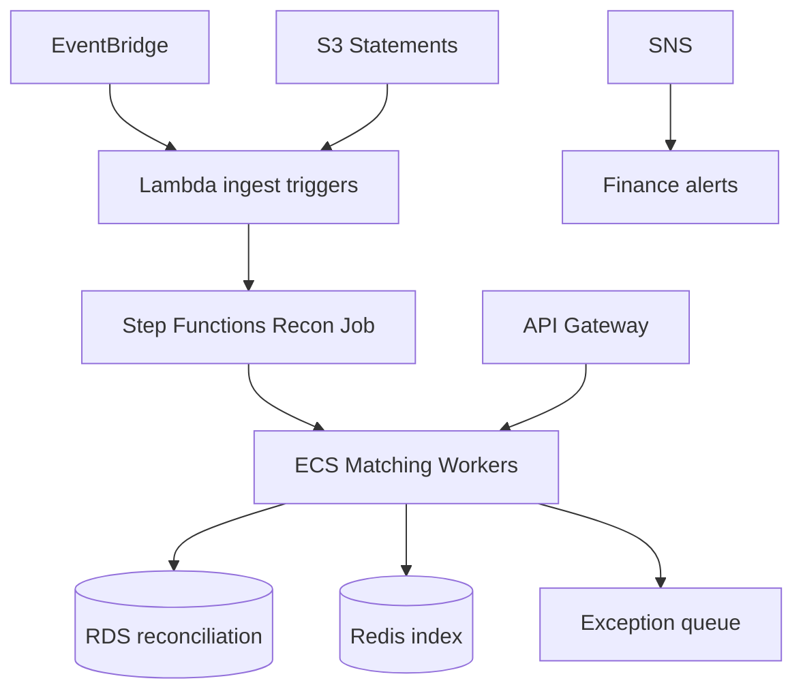
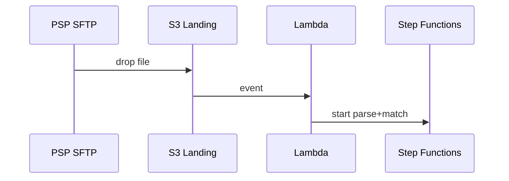

# 11 — AWS Architecture

---

## Executive summary

API Gateway, EventBridge, Step Functions, Lambda, ECS, RDS, Redis, SQS, SNS, backup, security services.

---

## Component diagram

---

## Sequence: large file ingest

---

## Security / observability

[12](12_OBSERVABILITY.md)

---

## Operational considerations

Auto-scale workers on queue depth.

---

## Implementation strategy

IaC `tnpi-reconciliation`.

---

## Future expansion

MWAA for complex ETL if needed.

---

## Cross-references

[settlement/10_AWS_ARCHITECTURE.md](../settlement/10_AWS_ARCHITECTURE.md)
