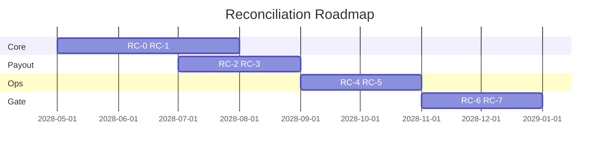

# 14 — Roadmap

```mermaid
gantt
  title Reconciliation Roadmap
  dateFormat YYYY-MM
  section Core
  RC-0 RC-1        :2028-05, 3M
  section Payout
  RC-2 RC-3        :2028-07, 2M
  section Ops
  RC-4 RC-5        :2028-09, 2M
  section Gate
  RC-6 RC-7        :2028-11, 2M
```

---

## Sprint breakdown

[PHASE6_GATE_PACKAGE.md](PHASE6_GATE_PACKAGE.md) §3.

---

## Cross-references

[13_PAYMENT_ROADMAP.md](../13_PAYMENT_ROADMAP.md)
