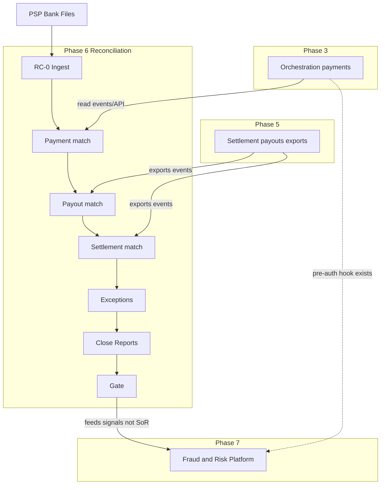

# TNPI Phase 6 — Gate Package (Reconciliation Platform)

**Status:** Architecture planning complete — Phase 5 Settlement gate assumed **approved**  
**Date:** 2026-08-06

---

## 1. Product Readiness Report

### Executive summary

The **Reconciliation Platform** pack (`docs/payments/reconciliation/00–18`) defines TNPI Phase 6: authoritative **financial verification**—matching, exceptions, closing, reporting—consuming orchestration/settlement data and PSP/bank statements. **No payments, settlement execution, or fraud engine.**

### Readiness matrix

| Dimension | Status |
| --- | --- |
| Vision, model, matching, exceptions, closing, reporting | ✅ |
| APIs, events, ER, security, AWS, observability | ✅ |
| Implementation guide, backlog, acceptance, risks | ✅ |
| **Implementation** | ⬜ |
| **Settlement export v1** | ✅ assumed from Phase 5 design |
| **Live PSP files in staging** | ⬜ |

### Verdict

| Question | Answer |
| --- | --- |
| Start Reconciliation **implementation**? | **Yes** (architecture) |
| Authoritative verification layer? | **Yes** — post-implementation |
| Start Phase 7 Fraud & Risk? | After §6 exit |

---

## 2. Dependency Graph

**Note:** Fraud (Phase 7) **consumes** recon exception patterns and payment events; recon does **not** replace fraud.

---

## 3. Sprint Breakdown

| Sprint | Duration | Focus | Backlog |
| --- | --- | --- | --- |
| **RC-0** | 2 wk | S3 landing, schema, job SF | RCB-001–002 |
| **RC-1** | 4 wk | M-Pesa 1:1 + tolerance | RCB-003–004 |
| **RC-2** | 3 wk | Payout recon | RCB-005 |
| **RC-3** | 3 wk | Settlement batch recon | RCB-006 |
| **RC-4** | 4 wk | Exceptions + adjustments | RCB-007–008 |
| **RC-5** | 3 wk | Daily close + reports | RCB-009–012 |
| **RC-6** | 2 wk | Real-time recon PoC | RCB-013 |
| **RC-7** | 2 wk | Gate + fraud handoff | RCB-014 |

---

## 4. Architecture Review Report

### Scope

Reconciliation as verification SoR vs orchestration/settlement SoR; adjustment boundaries; audit requirements.

### Findings

| ID | Finding | Severity | Action |
| --- | --- | --- | --- |
| AR-RC-01 | Recon read-only on payment/settlement aggregates | ✅ | Enforce via APIs only |
| AR-RC-02 | Adjustments must not silently fix orchestration | High | Event notify settlement; ADR |
| AR-RC-03 | Match engine false positives | High | Confidence + manual queue RC-4 |
| AR-RC-04 | Statement PII in S3 | Medium | KMS + lifecycle |
| AR-RC-05 | Close period immutability | High | RC-5 gates |
| AR-RC-06 | Phase 7 fraud separate from recon SoR | ✅ | Clear in Phase 7 pack |

### Proposed ADRs

- **ADR-TNPI-RC-001** — Reconciliation is verification SoR; adjustments are recon + settlement events only  
- **ADR-TNPI-RC-002** — Auto-match threshold changes require finance approval

### Verdict

**Approved to implement Phase 6** when settlement export schema STB-014 is frozen.

---

## 5. Production Readiness Assessment

| Area | Staging | Production |
| --- | --- | --- |
| PSP file SLAs | Manual upload OK | Automated SFTP/API |
| Match rate KPI | ≥98% | Monitored |
| Exception SLA | 48h | Staffed 24/5 |
| S3 statement retention | 90d | 7y compliance |
| DR | Restore test | Required |
| SoD maker-checker | RC-4 | Mandatory |

**Verdict:** Architecture **ready**; production recon **after** RC-1–RC-5 staging sign-off + treasury process.

---

## 6. Exit Criteria — Phase 7 (Fraud & Risk Platform)

Phase 7 may start when:

| # | Criterion |
| --- | --- |
| E1 | [16_ACCEPTANCE_CRITERIA.md](16_ACCEPTANCE_CRITERIA.md) AC-F1–F8 staging passed |
| E2 | Phase 6 gate signed |
| E3 | Daily provider recon running 30 consecutive sandbox days |
| E4 | Exception workflow with maker-checker demonstrated |
| E5 | `financial.close.completed` for daily close automated |
| E6 | Audit report sample approved by internal audit |
| E7 | Fraud platform **design pack** initiated (does not require recon prod) |
| E8 | Orchestration pre-auth **hook contract** documented for fraud (no fraud logic in recon) |
| E9 | Recon metrics feed spec for fraud (`recon.exceptions.open`, velocity) published |
| E10 | No payment authorization or settlement payout code in recon service (boundary audit) |

**Phase 7 scope (preview):** Real-time fraud scoring, risk rules, lists, case management—consumes `payment.*` and recon signals; does not replace recon verification SoR.

---

## Cross-references

[00_INDEX.md](00_INDEX.md) · [settlement/PHASE5_GATE_PACKAGE.md](../settlement/PHASE5_GATE_PACKAGE.md)
