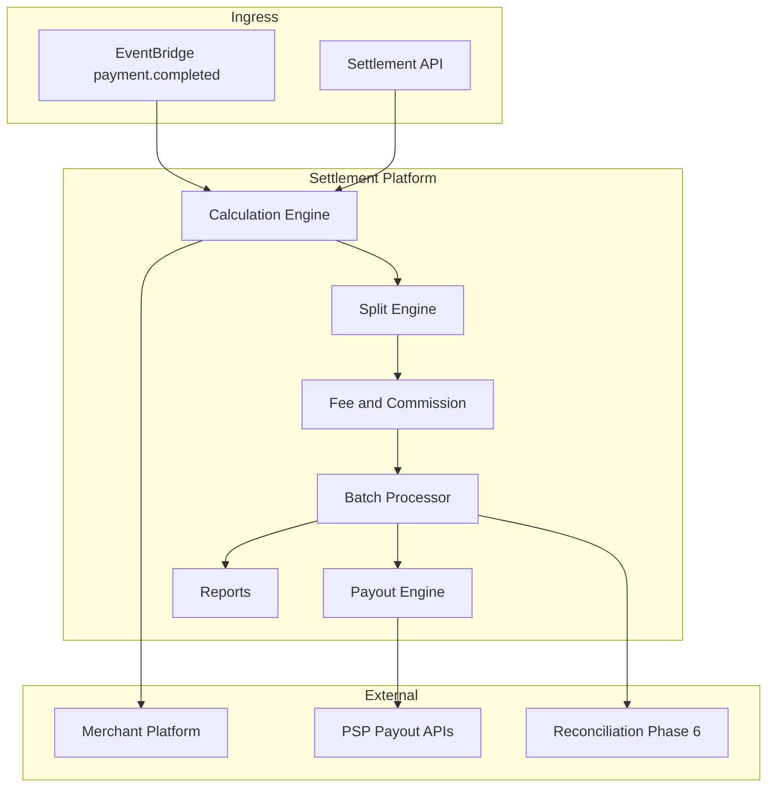
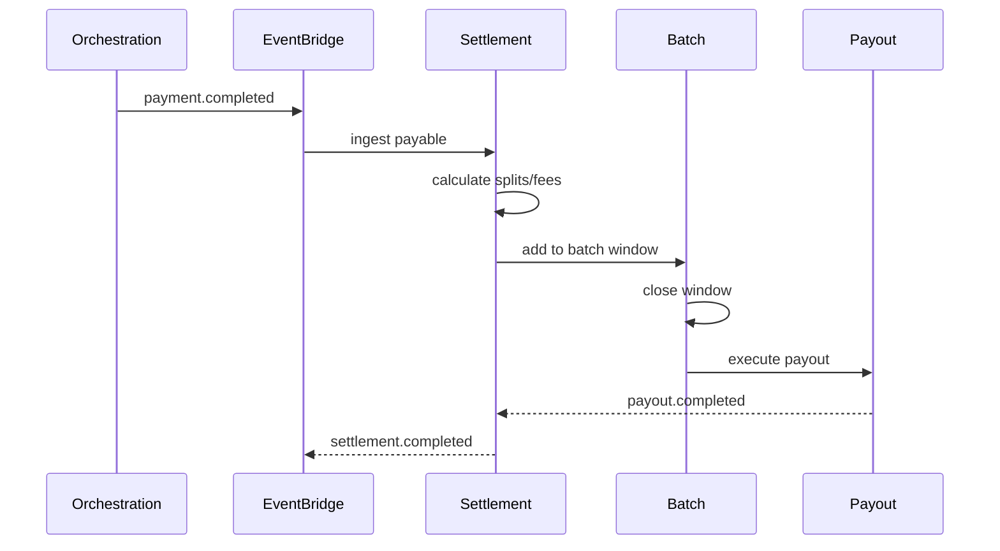

# 01 — Product Vision

---

## Executive summary

Taifa **Settlement Platform** (Phase 5): enterprise settlement for millions of transactions—accurate splits, scheduled batches, payouts via bank and mobile money, transparent reporting—consuming orchestration facts, feeding reconciliation.

---

## Business purpose

Merchants and partners trust Taifa when payouts are predictable, auditable, and correct.

---

## Architecture overview

---

## Product vision

**Every completed payment becomes a clear financial obligation—settled on time, every party paid correctly.**

---

## Supported settlement types

| Type | Examples |
| --- | --- |
| Merchant | Retail, hotels, restaurants |
| Marketplace | Vendor + platform fee |
| Government | Tax + agency remittance |
| Transport | Operator + levy |
| Tourism | Operator + guide split |
| Insurance | Hospital + insurer |
| Refund/chargeback | Settlement adjustments |

---

## Capability model

Settlement calculation · scheduling · windows/calendar · execution · instructions · batches · splits · fees/commissions/tax hooks · payouts · reports · notifications · exceptions · reversals · audit.

---

## Settlement flow (high level)

---

## Split payment flow

See [03_SPLIT_PAYMENTS.md](03_SPLIT_PAYMENTS.md).

---

## Security / AWS / implementation

[09](09_SECURITY_MODEL.md) · [10](10_AWS_ARCHITECTURE.md) · [11](11_IMPLEMENTATION_GUIDE.md)

---

## Operational model

Cutoff times TZ Africa/Dar_es_Salaam; holiday calendar; exception queue staffed finance ops.

---

## Future expansion

Instant T+0 payouts; FX settlement; CBDC rails.

---

## Cross-references

[PHASE5_GATE_PACKAGE.md](PHASE5_GATE_PACKAGE.md)
