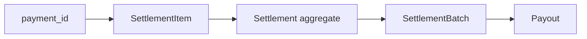
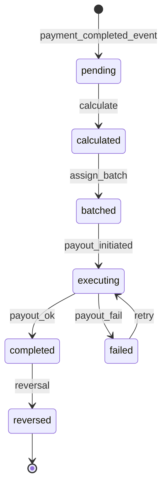
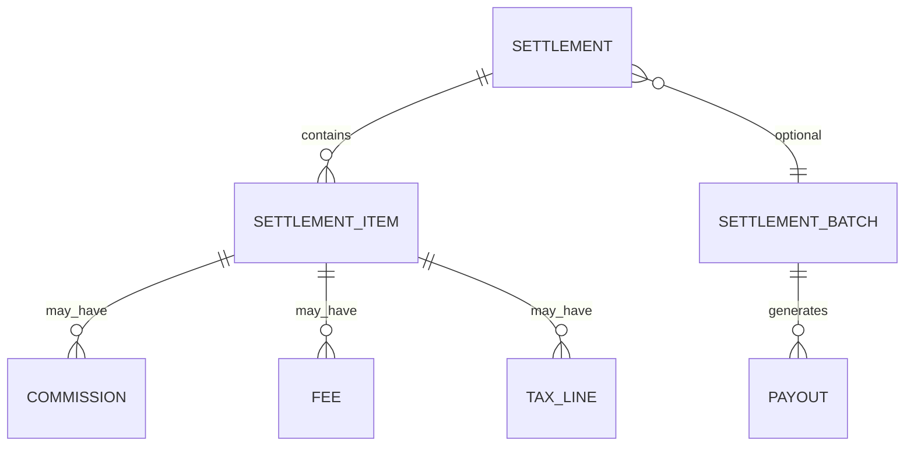

# 02 — Settlement Model

**Bounded context:** `finance.settlement`

---

## Executive summary

Core domain: **Settlement**, **SettlementItem**, instructions, commissions, fees, tax lines, linkage to `payment_id` from orchestration—Taifa tracks **obligations and payout state**, not consumer balances.

---

## Business purpose

Single SoR for what is owed and what was paid out.

---

## Architecture overview

---

## Aggregate: Settlement

| Attribute | Description |
| --- | --- |
| `settlement_id` | UUID |
| `payment_id` | Orchestration reference |
| `merchant_id` | Primary merchant |
| `workflow_type` | merchant, marketplace, gov, transport, tourism |
| `status` | pending, calculated, batched, executing, completed, failed, reversed |
| `gross_amount` | Money VO |
| `net_payable` | After fees/tax |
| `settlement_window` | Business date + cutoff |

---

## State machine

---

## Settlement workflows

| Workflow | Trigger metadata |
| --- | --- |
| Merchant standard | `channel`, MCC |
| Marketplace | `split_rules[]` |
| Government | `gov.agency_id`, levy codes |
| Transport | `mobility.operator_id` |
| Tourism | `tourism.product_type` |
| Refund settlement | `payment.refunded` adjustment |
| Chargeback | `payment.chargeback` |

---

## ER snippet

---

## API / events

[06](06_API_SPECIFICATION.md) · [07](07_EVENT_CATALOG.md)

---

## Security

Maker-checker on manual adjustments.

---

## AWS

RDS settlement schema.

---

## Implementation strategy

Idempotent ingest per `payment_id`.

---

## Future expansion

Multi-currency settlement records.

---

## Cross-references

[08_DATABASE_MODEL.md](08_DATABASE_MODEL.md)
