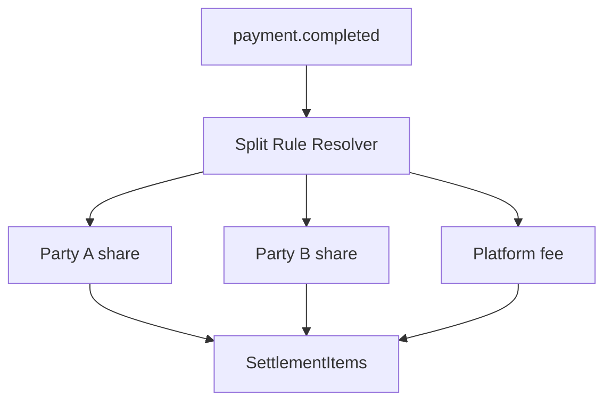
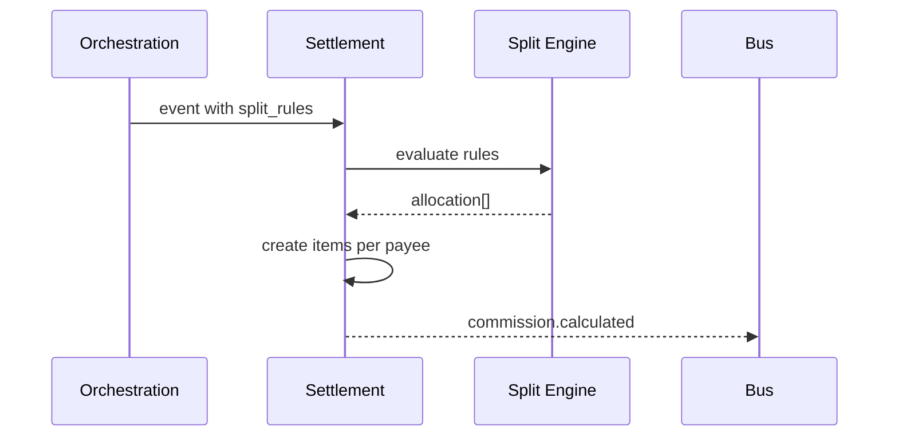

# 03 — Split Payments

---

## Executive summary

**Split settlement** for multi-party payments: percentage, fixed, hierarchical, and future programmable rules.

---

## Business purpose

Marketplaces and tourism/gov/insurance require automatic fund allocation.

---

## Architecture

---

## Split flow

---

## Use cases

| Scenario | Split pattern |
| --- | --- |
| Hotel + guide | % to guide account |
| Marketplace | vendor net + platform % |
| Government tax | levy + merchant net |
| Insurance + hospital | policy split metadata |
| Transport + levy | operator + authority fixed fee |

---

## Rule types

| Type | Example |
| --- | --- |
| `percentage` | Platform 2.5% |
| `fixed` | TZS 500 levy |
| `hierarchical` | Remainder to primary merchant |
| `programmable` | Phase 2 — DSL + approval |

---

## Validation

Sum of splits + fees + tax = gross (assert in domain).

---

## API / events / DB

Split rules from orchestration `metadata` or merchant config API.

---

## Security

Approved rule changes audited.

---

## Implementation strategy

v1: static rules in payment metadata; v2: merchant rule catalog.

---

## Future expansion

Smart contract style splits (regulated).

---

## Cross-references

[02_SETTLEMENT_MODEL.md](02_SETTLEMENT_MODEL.md)
