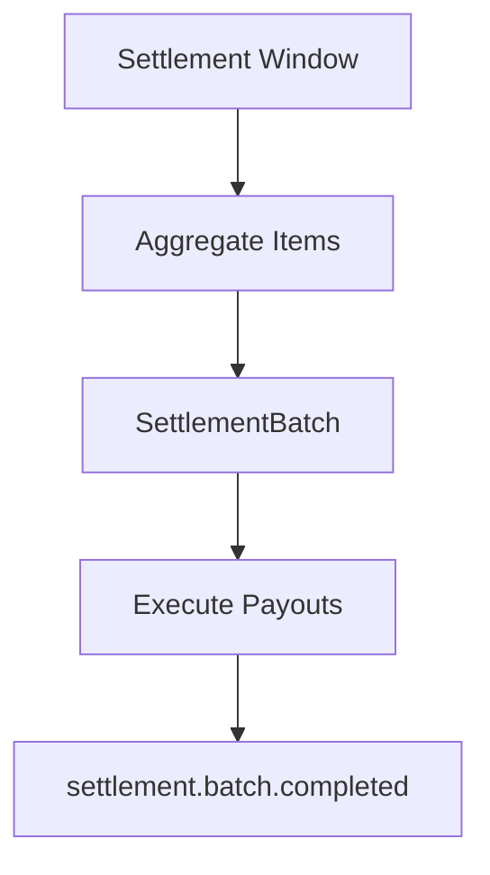
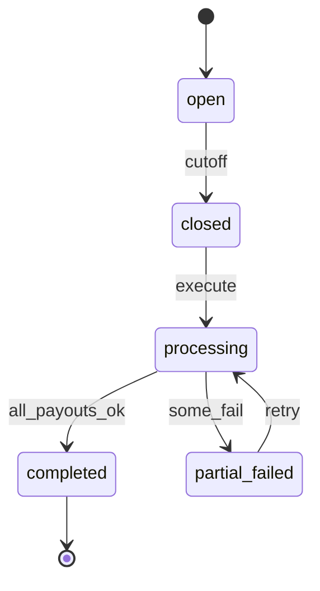
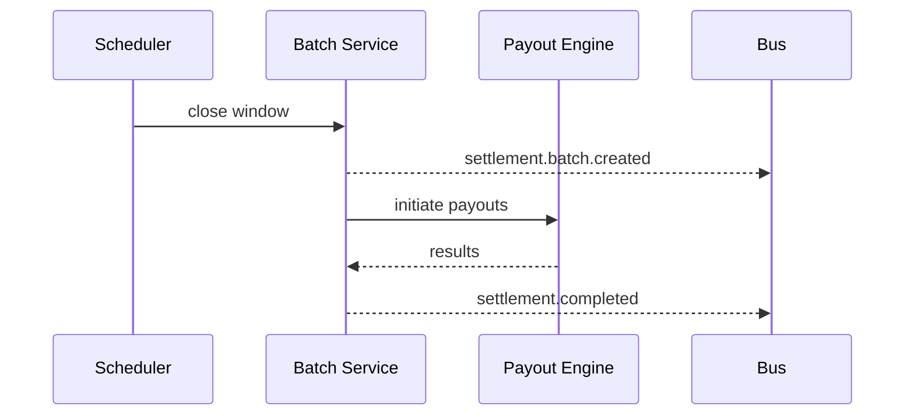

# 04 — Batch Processing

---

## Executive summary

**Settlement batches**: windows, calendar, cutoffs, aggregation, batch creation, execution scheduling, exception handling.

---

## Business purpose

Efficient PSP payout files and treasury operations.

---

## Architecture

---

## Settlement calendar

| Concept | Definition |
| --- | --- |
| Window | e.g. daily 23:00 EAT cutoff |
| T+1 / T+0 | Payout delay policy per merchant tier |
| Holiday | Skip or early close via calendar service |

---

## Batch state

---

## Sequence: batch close

---

## API / events / DB

[06](06_API_SPECIFICATION.md) · `settlement.batch.*` · [08](08_DATABASE_MODEL.md)

---

## AWS

Step Functions batch pipeline; EventBridge schedule.

---

## Security

Batch totals dual-control sign-off for &gt; threshold.

---

## Operational model

Finance ops dashboard; reopen batch ADR-only.

---

## Implementation strategy

Start daily merchant batch; add vertical batches later.

---

## Future expansion

Real-time micro-batches for instant tier.

---

## Cross-references

[05_PAYOUT_ENGINE.md](05_PAYOUT_ENGINE.md)
