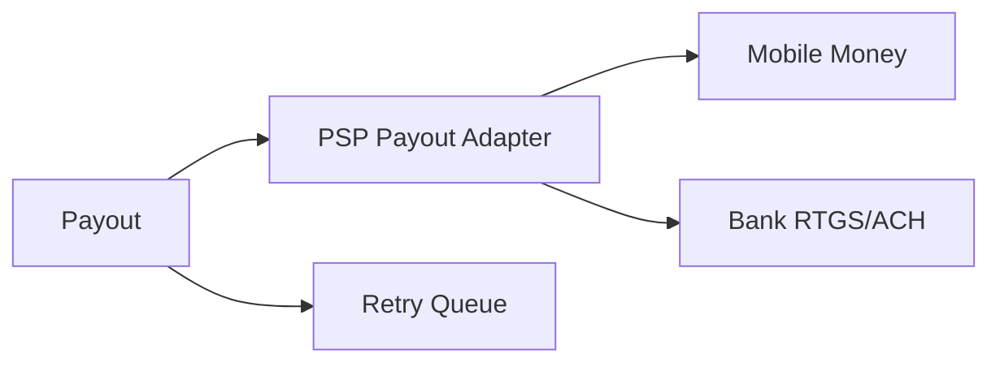
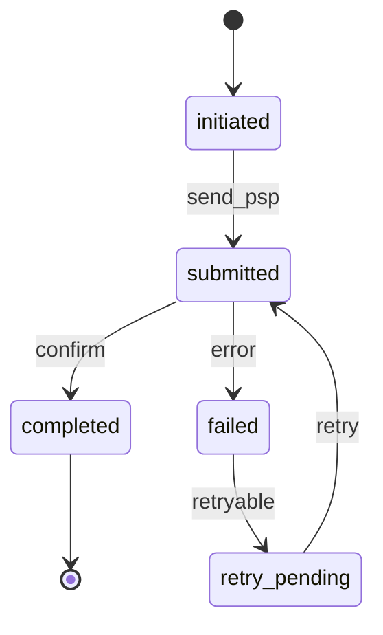
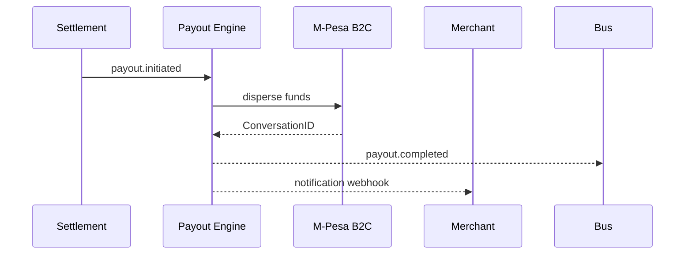

# 05 — Payout Engine

---

## Executive summary

Execute **payouts**: bank transfer, mobile money (M-Pesa B2C, etc.), batch/scheduled, retry, failure recovery, notifications.

---

## Business purpose

Convert settlement obligations into PSP money movement instructions.

---

## Architecture

---

## Payout state

---

## Sequence: M-Pesa B2C payout

---

## Capabilities

| Feature | Phase 5 |
| --- | --- |
| Bank transfer | ● |
| Mobile money payout | ● |
| Batch payout | ● |
| Scheduled | ● |
| Instant T+0 | Future flag |
| Retry | ● |
| Failure recovery | ● |

Destination accounts from [Merchant Platform settlement accounts](../merchant/07_API_SPECIFICATION.md).

---

## API / events / security

Payout approval workflow for high value; KMS for API keys.

---

## AWS

SQS retry; DLQ; Lambda status callbacks.

---

## Implementation strategy

Idempotent payout per `settlement_item_id`.

---

## Operational model

Treasury reconciliation handoff to Phase 6.

---

## Future expansion

Multi-currency nostro.

---

## Cross-references

[07_EVENT_CATALOG.md](07_EVENT_CATALOG.md)
