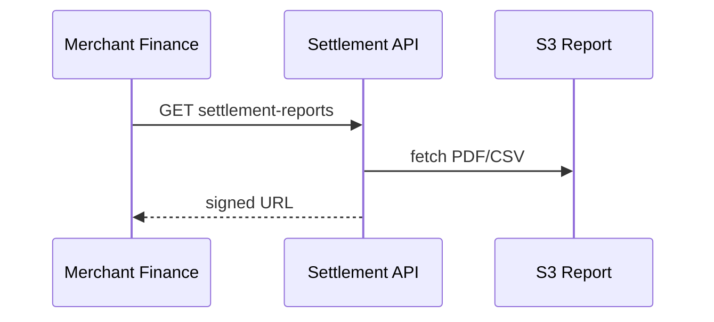

# 06 — API Specification

**Base:** `/api/v1/settlement` · Auth: service + merchant finance roles

---

## Executive summary

Settlement, payout, batch, commission, and report APIs.

---

## Settlement

| Method | Path | Description |
| --- | --- | --- |
| GET | `/settlements/{id}` | Settlement detail |
| GET | `/settlements` | Query by merchant, date, status |
| POST | `/internal/settlements/recalculate` | Ops recalc (maker-checker) |
| POST | `/internal/settlements/{id}/reverse` | Reversal |

---

## Batches

| Method | Path |
| --- | --- |
| GET | `/settlement-batches` |
| GET | `/settlement-batches/{id}` |
| POST | `/internal/settlement-batches/{id}/close` |
| POST | `/internal/settlement-batches/{id}/execute` |

---

## Payouts

| Method | Path |
| --- | --- |
| GET | `/payouts/{id}` |
| GET | `/payouts` |
| POST | `/internal/payouts/{id}/retry` |

---

## Merchant-facing

| Method | Path |
| --- | --- |
| GET | `/merchants/{id}/settlements` |
| GET | `/merchants/{id}/settlement-reports/{period}` |
| GET | `/merchants/{id}/payouts` |

---

## Commissions & fees

| Method | Path |
| --- | --- |
| GET | `/commissions` | Ops |
| GET | `/merchants/{id}/fee-summary` |

---

## Sequence: merchant report download

---

## Events / DB / security / AWS

[07](07_EVENT_CATALOG.md) · [08](08_DATABASE_MODEL.md) · maker-checker on internal POSTs.

---

## Implementation strategy

OpenAPI `tnpi-settlement-v1`.

---

## Future expansion

Webhook `settlement.completed` to merchants (orchestration webhook platform reuse).

---

## Cross-references

[orchestration/07_API_SPECIFICATION.md](../orchestration/07_API_SPECIFICATION.md)
