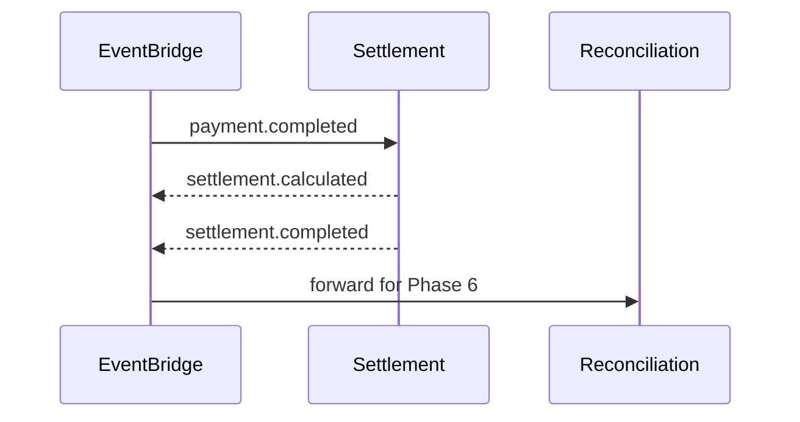

# 07 — Event Catalog

**Prefix:** `settlement.*`, `payout.*`, `commission.*`

---

## Executive summary

Settlement domain events; consumes `payment.completed`, `payment.refunded` from orchestration.

---

## Inbound (subscribe)

| event_type | Action |
| --- | --- |
| `payment.completed` | Create pending settlement |
| `payment.refunded` | Adjustment / reversal workflow |
| `payment.settlement.requested` | Fast-path ingest (orchestration) |

---

## Outbound

| event_type | When |
| --- | --- |
| `settlement.created` | Record created |
| `settlement.calculated` | Splits/fees applied |
| `settlement.batch.created` | Batch closed |
| `settlement.executed` | Payouts submitted |
| `settlement.completed` | Batch success |
| `settlement.failed` | Terminal batch/payout failure |
| `settlement.reversed` | Reversal posted |
| `payout.initiated` | Per payout |
| `payout.completed` | PSP confirm |
| `payout.failed` | Retry eligible |
| `commission.calculated` | Split result |

---

## Sequence

---

## API / DB / security

Correlation via `payment_id`; no PAN.

---

## Implementation strategy

Schema registry; idempotent consumers.

---

## Future expansion

`settlement.instant.completed`

---

## Cross-references

[05_RECONCILIATION.md](../05_RECONCILIATION.md)
