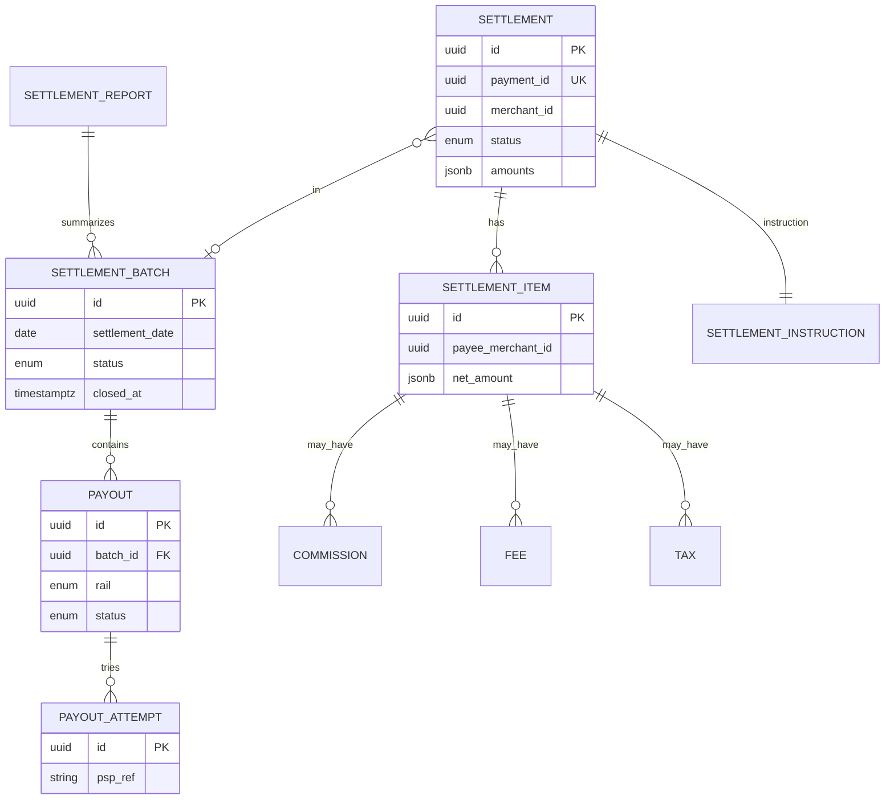

# 08 — Database Model

**Schema:** `settlement` (PostgreSQL)

---

## Executive summary

Enterprise ER for settlement, batches, items, instructions, commissions, fees, tax, payouts, reports, audit.

---

## ER diagram

---

## Reconciliation handoff

Export `settlement_batch_id`, `payout_id`, `psp_ref` for Phase 6 matcher.

---

## API / events / security

Encrypt payee account tokens; audit all mutations.

---

## AWS

RDS Multi-AZ; S3 for reports; read replica for merchant queries.

---

## Implementation strategy

Ledger postings reference `settlement_id` per [PAYMENTS.md](../../PAYMENTS.md).

---

## Future expansion

Partition payouts by month.

---

## Cross-references

[02_SETTLEMENT_MODEL.md](02_SETTLEMENT_MODEL.md)
