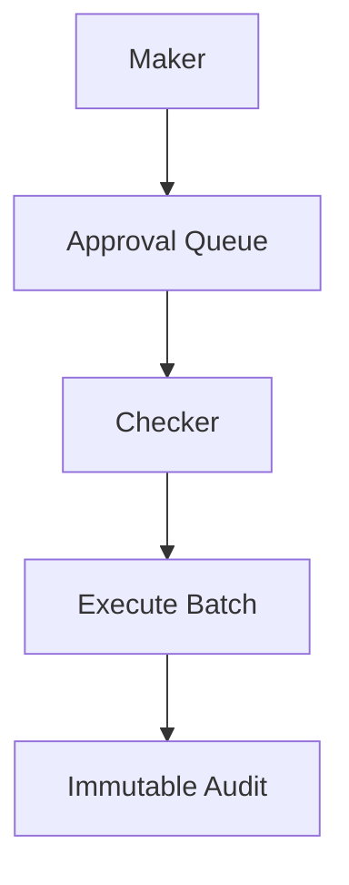

# 09 — Security Model

---

## Executive summary

Maker-checker, approval workflows, audit trails, digital signatures (batch approval), encryption, KMS, secrets, settlement authorization.

---

## Business purpose

Settlement errors are financial and regulatory incidents.

---

## Architecture

---

## Controls

| Control | Application |
| --- | --- |
| RBAC | `finance.ops`, `finance.approver`, `merchant.finance` read |
| ABAC | Amount thresholds |
| Maker-checker | Manual adjust, batch execute &gt; limit |
| Audit | All state changes |
| Encryption | RDS KMS, S3 reports |
| Secrets | PSP payout credentials in SM |
| Signatures | Optional batch hash sign for treasury |

---

## API / events / AWS

CloudTrail; separation of duties IAM.

---

## Implementation strategy

SOC-style access reviews quarterly.

---

## Future expansion

HSM for batch signing.

---

## Cross-references

[17_COMPLIANCE_GUIDE.md](../17_COMPLIANCE_GUIDE.md)
