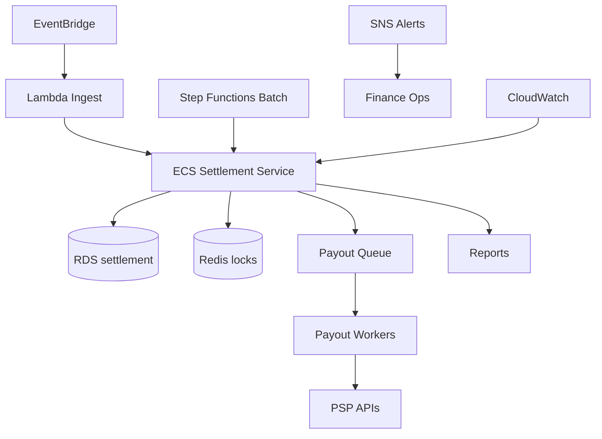
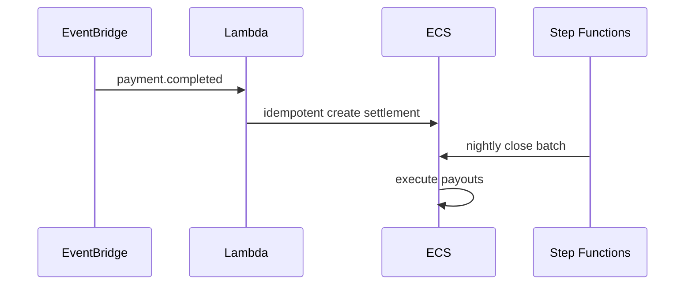

# 10 — AWS Architecture

---

## Executive summary

Event-driven settlement on EventBridge, Step Functions, Lambda, ECS, RDS, Redis, SQS, SNS, observability & backup.

---

## Component diagram

---

## Sequence: event to batch

---

## Security / operational model

Least privilege; no public RDS; backup RPO 5m.

---

## Implementation strategy

IaC module `tnpi-settlement`.

---

## Future expansion

Multi-region read for reporting.

---

## Cross-references

[11_AWS_ARCHITECTURE.md](../11_AWS_ARCHITECTURE.md) program
