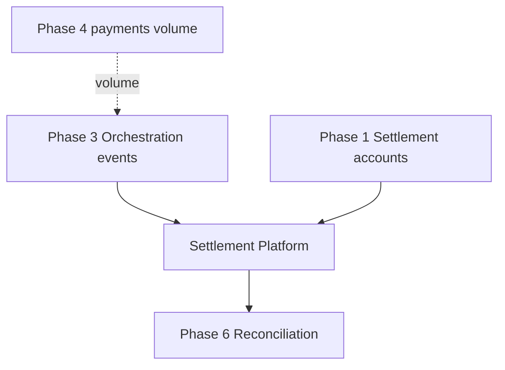

# 11 — Implementation Guide

---

## Executive summary

Phase 5 implementation stages ST-0 through ST-7; consumes orchestration events; produces recon-ready exports.

---

## Dependencies

---

## Stages

| Stage | Weeks | Deliverable |
| --- | --- | --- |
| ST-0 | 2 | Schema, OpenAPI, ingest consumer |
| ST-1 | 4 | Calculate merchant standard settlement |
| ST-2 | 3 | Batch windows + calendar |
| ST-3 | 4 | Payout engine M-Pesa B2C |
| ST-4 | 3 | Split payments v1 |
| ST-5 | 3 | Reports + merchant APIs |
| ST-6 | 2 | Maker-checker + exceptions |
| ST-7 | 2 | Gate + recon export format |

---

## Implementation strategy

Feature flag `tnpi.settlement`; parallel run with manual treasury compare.

---

## Operational model

Daily ops checklist; exception SLA 24h.

---

## Future expansion

Bank payout rail #2.

---

## Cross-references

[13_BACKLOG.md](13_BACKLOG.md) · [PHASE5_GATE_PACKAGE.md](PHASE5_GATE_PACKAGE.md)
