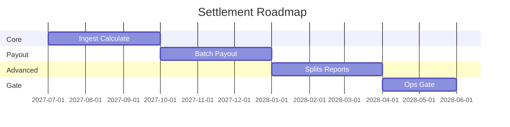

# 12 — Roadmap

---

## Implementation roadmap

| Quarter | Milestone |
| --- | --- |
| 2027 Q3 | ST-0–ST-2 ingest + batch |
| 2027 Q4 | ST-3 payouts sandbox |
| 2028 Q1 | ST-4–ST-5 splits + reports |
| 2028 Q2 | ST-6–ST-7 gate + recon handoff |

---

## Sprint plan

See [PHASE5_GATE_PACKAGE.md](PHASE5_GATE_PACKAGE.md) §2.

---

## Cross-references

[13_PAYMENT_ROADMAP.md](../13_PAYMENT_ROADMAP.md)
