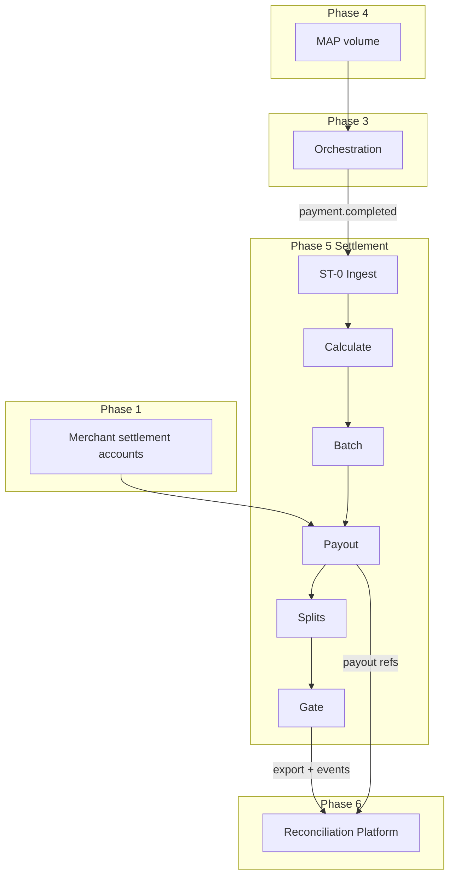

# TNPI Phase 5 — Gate Package (Settlement Platform)

**Status:** Architecture planning complete — Phases 1–4 + Orchestration assumed **approved**  
**Date:** 2026-08-06

---

## 1. Product Readiness Report

### Executive summary

The **Settlement Platform** pack (`docs/payments/settlement/00–16`) defines TNPI Phase 5: calculation, scheduling, batches, splits, fees/commissions, payouts, reports, and audit—**consuming Orchestration** (`payment.completed`, `payment.settlement.requested`) and **feeding Reconciliation** (Phase 6).

### Readiness matrix

| Dimension | Status |
| --- | --- |
| Vision, model, splits, batches, payouts | ✅ |
| APIs, events, ER model | ✅ |
| Security (maker-checker), AWS | ✅ |
| Implementation guide, roadmap, backlog | ✅ |
| Acceptance, DoD, risks | ✅ |
| **Production code** | ⬜ |
| **Live payout in sandbox** | ⬜ |
| **Orchestration events in staging** | ✅ assumed |

### Verdict

| Question | Answer |
| --- | --- |
| Start Settlement **implementation**? | **Yes** (architecture) |
| Start **Reconciliation** (Phase 6)? | After §4 exit |
| Replace orchestration? | **Never** |

---

## 2. Dependency Graph

**External:** M-Pesa B2C, bank APIs, treasury funding, BoT reporting rules.

---

## 3. Sprint Plan

| Sprint | Duration | Focus | Backlog |
| --- | --- | --- | --- |
| **ST-0** | 2 wk | Schema, ingest, OpenAPI | STB-001–002 |
| **ST-1** | 4 wk | Calculate + ledger hook | STB-003–004 |
| **ST-2** | 3 wk | Windows + batches | STB-005–006 |
| **ST-3** | 4 wk | Payout M-Pesa + retry | STB-007–008 |
| **ST-4** | 3 wk | Splits + refunds adj | STB-009–010, 015 |
| **ST-5** | 3 wk | Reports + merchant APIs | STB-011 |
| **ST-6** | 2 wk | Exceptions + maker-checker | STB-012–013 |
| **ST-7** | 2 wk | Recon export + gate | STB-014–016 |

---

## 4. Implementation Roadmap

See [12_ROADMAP.md](12_ROADMAP.md) — 2027 Q3 through 2028 Q2 gate.

---

## 5. Architecture Review Report

### Scope

Settlement vs Orchestration vs Acceptance vs Ledger ([PAYMENTS.md](../../PAYMENTS.md)) vs Reconciliation.

### Findings

| ID | Finding | Severity | Action |
| --- | --- | --- | --- |
| AR-ST-01 | Settlement only post-`payment.completed` | ✅ | Enforce event contract |
| AR-ST-02 | No consumer float—payout instructions only | ✅ | Legal/treasury alignment |
| AR-ST-03 | Split rules source of truth | Medium | Orchestration metadata + merchant catalog ADR |
| AR-ST-04 | Double ingest risk | High | Unique `payment_id` + idempotent consumer |
| AR-ST-05 | Recon export schema versioned | Medium | STB-014 before Phase 6 start |
| AR-ST-06 | Maker-checker for production batches | High | ST-6 mandatory before prod payouts |

### Proposed ADRs

- **ADR-TNPI-ST-001** — Settlement ingest only via events + internal repair API  
- **ADR-TNPI-ST-002** — Acceptance ledger postings on `settlement.completed` not `payment.completed`

### Verdict

**Approved to implement Phase 5** when orchestration emits stable completion events.

---

## 6. Exit Criteria — Phase 6 (Reconciliation Platform)

Per [05_RECONCILIATION.md](../05_RECONCILIATION.md):

| # | Criterion |
| --- | --- |
| E1 | [14_ACCEPTANCE_CRITERIA.md](14_ACCEPTANCE_CRITERIA.md) AC-F1–F8 staging sign-off |
| E2 | Phase 5 gate signed |
| E3 | Recon export v1 schema published and sample files validated |
| E4 | ≥1 full cycle: payments → settlement batch → payout → export |
| E5 | Exception rate &lt; 0.1% on sandbox batch |
| E6 | Treasury sign-off on payout reconciliation sample |
| E7 | No reconciliation matching logic in settlement service (boundary audit) |
| E8 | `settlement.completed` and `payout.completed` events consumed by recon design |

---

## 7. Production Readiness Assessment

| Area | Staging | Production |
| --- | --- | --- |
| Payout PSP agreements | Sandbox | **Required** |
| Maker-checker | ST-6 | Mandatory |
| DR RDS | Test restore | Before prod |
| SLO batch completion | T+1 window | Monitored |
| Liquidity / prefunding | Simulated | Treasury process |
| National payout volume | Load test ST-7 | Scale workers |

**Verdict:** Architecture **ready**; production payouts **not ready** until ST-3 prod PSP + ST-6 + E2 sign-off.

---

## Cross-references

[00_INDEX.md](00_INDEX.md) · [merchant-acceptance/PHASE4_GATE_PACKAGE.md](../merchant-acceptance/PHASE4_GATE_PACKAGE.md)
