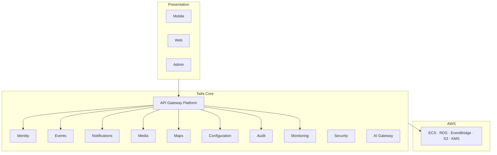

# 00 — Taifa Core Platform Overview

**Phase:** 1 — **TAIFA CORE PLATFORM FOUNDATION**  
**Status:** Engineering blueprint **approved** — Sprint 0 implementation **conditional GO** ([14](14_PLATFORM_IMPLEMENTATION_GUIDE.md) § Readiness)  
**Authority:** [`architecture/00_ARCHITECTURE_CONSTITUTION.md`](../architecture/00_ARCHITECTURE_CONSTITUTION.md) · EARB [`earb/`](earb/README.md)

---

## Mission

Build **Taifa Core** — the reusable national platform every module consumes: Identity, API edge, events, notifications, media, maps, configuration, audit, observability, security, CI/CD, and AWS infrastructure.

**Not in scope:** Tourism workflows, Commerce verticals, Trade, Health/Edu/Gov product features.

---

## Business value

| Stakeholder | Value |
| --- | --- |
| **Domains** | Ship faster via ports/SDKs; no second login, bus, or notify stack |
| **Citizens** | One account, consistent security, reliable delivery |
| **Government / regulators** | Central audit, residency, KMS |
| **Partners** | One API gateway, keys, webhooks, OpenAPI |

---

## Platform architecture

```
                    TAIFA CORE

┌─────────────────────────────────────────────────────────────┐
│  Presentation (consumers — not built in Phase 1 features)   │
│  Mobile · Web · Business Portal · Admin Portal              │
└─────────────────────────────┬───────────────────────────────┘
                              │
┌─────────────────────────────▼───────────────────────────────┐
│  Platform Services (Phase 1 deliverables)                    │
│  Identity · API Gateway · Events · Notifications · Media    │
│  Maps · Configuration · Audit · Monitoring · Security         │
│  AI Gateway · Search (facade)                                 │
└─────────────────────────────┬───────────────────────────────┘
                              │
┌─────────────────────────────▼───────────────────────────────┐
│  Domain applications (FROZEN in Phase 1 — maintenance only) │
│  Pay spine · commerce · tourism · trips · ecosystem         │
└─────────────────────────────┬───────────────────────────────┘
                              │
┌─────────────────────────────▼───────────────────────────────┐
│  Infrastructure — AWS (af-south-1)                          │
└─────────────────────────────────────────────────────────────┘
```



---

## Phase 1 goals (13 capabilities)

| # | Capability | Doc |
| --- | --- | --- |
| 1 | Identity Platform | [01_IDENTITY_PLATFORM.md](01_IDENTITY_PLATFORM.md) |
| 2 | API Gateway Platform | [02_API_GATEWAY_PLATFORM.md](02_API_GATEWAY_PLATFORM.md) |
| 3 | Event Platform | [03_EVENT_PLATFORM.md](03_EVENT_PLATFORM.md) |
| 4 | Notification Platform | [04_NOTIFICATION_PLATFORM.md](04_NOTIFICATION_PLATFORM.md) |
| 5 | Media Platform | [05_MEDIA_PLATFORM.md](05_MEDIA_PLATFORM.md) |
| 6 | Maps Platform | [06_MAPS_PLATFORM.md](06_MAPS_PLATFORM.md) |
| 7 | Configuration Platform | [07_CONFIGURATION_PLATFORM.md](07_CONFIGURATION_PLATFORM.md) |
| 8 | Feature Flags Platform | [08_FEATURE_FLAGS_PLATFORM.md](08_FEATURE_FLAGS_PLATFORM.md) |
| 9 | Audit & Logging | [09_AUDIT_PLATFORM.md](09_AUDIT_PLATFORM.md) |
| 10 | Monitoring & Observability | [10_MONITORING_PLATFORM.md](10_MONITORING_PLATFORM.md) |
| 11 | Shared SDKs | [14_PLATFORM_IMPLEMENTATION_GUIDE.md](14_PLATFORM_IMPLEMENTATION_GUIDE.md) § SDKs |
| 12 | Platform Security | [11_SECURITY_PLATFORM.md](11_SECURITY_PLATFORM.md) |
| 13 | CI/CD | [12_CICD_PLATFORM.md](12_CICD_PLATFORM.md) |
| 14 | Infrastructure as Code | [13_INFRASTRUCTURE_PLATFORM.md](13_INFRASTRUCTURE_PLATFORM.md) |

---

## Repository structure (target)

```
TAIFA APP REMAKE/
├── apps/backend/
│   ├── config/                 # gateway middleware, health
│   ├── taifa_kernel/           # EventEnvelope, Money, shared VOs
│   ├── taifa_platform/         # Core packages (identity, events, audit, …)
│   ├── payments/               # Pay spine (integrate with Core; no new rails)
│   ├── enterprise/             # workflow, outbox (migrate to event platform)
│   ├── integrations/           # adapter registry
│   └── ecosystem/              # module catalog, AI invoke facade
├── apps/mobile/lib/platform/   # Dart SDK surface
├── packages/                   # taifa-python, taifa-dart clients
├── infra/                      # Terraform/CDK — af-south-1
└── docs/platform/00–14          # this pack
```

**Monorepo rule:** New Core code lives in `taifa_kernel` + `taifa_platform`; domains call **ports** only.

---

## Bounded context map (Core)

| Context | Prefix | SoR |
| --- | --- | --- |
| `platform.identity` | `identity.*` | Users, sessions, devices, orgs |
| `platform.gateway` | — | Routes, keys, rate limits (config) |
| `platform.events` | envelope + bus | Outbox, schemas, subscriptions |
| `platform.notifications` | `notification.*` | Delivery jobs, templates |
| `platform.media` | `media.*` | Object metadata, virus scan status |
| `platform.maps` | — | Cache of geocode routes (no map tiles SoR) |
| `platform.config` | — | Feature flags, tenant config refs |
| `platform.audit` | `audit.*` | Immutable audit records |
| `platform.observability` | — | Metrics/log/trace config |

Business domains **must not** duplicate these contexts.

---

## OpenAPI & events

- REST law: [`architecture/03_API_STANDARDS.md`](../architecture/03_API_STANDARDS.md)  
- Events: [`architecture/02_EVENT_CATALOG.md`](../architecture/02_EVENT_CATALOG.md) + [ADR-0002](../architecture/adr/0002-event-catalog-prefix-policy.md)  
- Core public APIs: `/api/v1/platform/*` (new) alongside existing `/api/v1/ecosystem/*` during migration.

---

## Phase 1 exit criteria

See [14_PLATFORM_IMPLEMENTATION_GUIDE.md](14_PLATFORM_IMPLEMENTATION_GUIDE.md) § Exit criteria. Summary:

- Staging AWS live from IaC  
- Identity OIDC path + device bridge documented and tested  
- EventBridge + outbox publishing `finance.payment.captured` (reference)  
- Notifications send API used by outbox  
- Audit append API + CloudTrail alignment  
- CI/CD deploy staging; DoD on all PRs  
- **No new business-domain features merged**

---

## Cross-references

- [14_PLATFORM_IMPLEMENTATION_GUIDE.md](14_PLATFORM_IMPLEMENTATION_GUIDE.md) · [15_PLATFORM_ROADMAP.md](15_PLATFORM_ROADMAP.md)  
- Pre-core S1 work: [`earb/10_PLATFORM_FOUNDATION_IMPLEMENTATION_PLAN.md`](earb/10_PLATFORM_FOUNDATION_IMPLEMENTATION_PLAN.md)  
- [`DIGITAL_ECOSYSTEM.md`](../DIGITAL_ECOSYSTEM.md)
