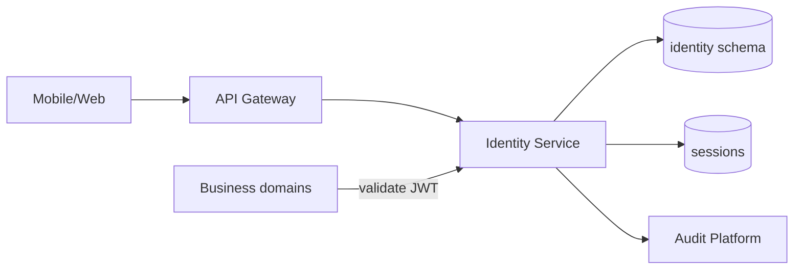

# 01 — Identity Platform

**Bounded context:** `platform.identity`  
**Phase 1:** Bridge device auth → OIDC-ready national identity

---

## Purpose & business value

Single **citizen, tourist, merchant, and government** identity for Tanzania’s super-app: registration, login, sessions, MFA, RBAC/ABAC, organizations, and device trust—so domains never implement their own login.

---

## Responsibilities

| In scope | Out of scope |
| --- | --- |
| User/citizen registry, credentials, sessions | Domain business profiles (trip, order) |
| OAuth2 / OIDC token issuance & validation | Payment KYC storage (references Identity tier) |
| RBAC/ABAC policy enforcement hooks | Tourism party data (orchestration) |
| Device registration & binding | Partner CRM |

---

## Architecture

**Phase-1 reality:** Device tokens in `payments` devices table; Identity **facade** in `taifa_platform/identity` unifies validation and migrates to full User model.

---

## Microservices (logical)

| Service | Responsibility |
| --- | --- |
| `identity-directory` | Users, profiles, orgs |
| `identity-session` | Refresh tokens, revoke |
| `identity-device` | Device trust, attestation hooks |
| `identity-policy` | RBAC roles, ABAC attributes |

**Deploy:** Modular monolith package → extract when &gt;5M MAU or separate compliance zone.

---

## Domain model

**Entities:** `User`, `Organization`, `Membership`, `Device`, `Session`, `Credential`, `MfaEnrollment`  
**Value objects:** `SubjectId`, `PhoneE164`, `Email`, `IdentityTier`, `Locale`, `ConsentRecord`

---

## APIs (target `/api/v1/platform/identity/`)

| Method | Path | Notes |
| --- | --- | --- |
| POST | `/register` | Phone/email citizen |
| POST | `/login` | Password or OTP |
| POST | `/token/refresh` | OAuth2 refresh |
| POST | `/logout` | Revoke session |
| GET | `/me` | Profile + tiers |
| POST | `/devices` | Register device |
| GET | `/organizations/{id}/members` | RBAC |
| POST | `/password/reset` | Async email/SMS via Notifications |

**Bridge (today):** `IsDevice` + device token — document mapping to `sub` in [14](14_PLATFORM_IMPLEMENTATION_GUIDE.md).

---

## Events

| Event | When |
| --- | --- |
| `identity.user.registered` | New user |
| `identity.user.verified` | KYC tier up |
| `identity.session.created` | Login |
| `identity.session.revoked` | Logout / compromise |
| `identity.device.registered` | New device |

---

## Database schema (logical)

`identity_user`, `identity_profile`, `identity_organization`, `identity_membership`, `identity_device`, `identity_session`, `identity_credential`, `identity_mfa` — UUID PKs, audit columns per [architecture/04](../architecture/04_DATABASE_STANDARDS.md).

---

## Security

OAuth2 + OIDC, JWT access (short TTL), refresh rotation, MFA for high-risk, step-up for pay, NIDA adapter via `TAIFA_IDENTITY_PROVIDERS_JSON`, bcrypt/argon2 passwords, rate limit login — [10_SECURITY_PLATFORM.md](10_SECURITY_PLATFORM.md).

---

## AWS

Cognito **optional** for partner IdP federation; primary: **ECS** + **RDS** + **Redis** sessions + **KMS** + **Secrets Manager**. WAF on auth routes.

---

## Deployment / scaling / monitoring

Horizontal ECS; read replicas for profile reads; cache session validation in Redis. Metrics: login success, MFA challenges, token validation latency. Alerts on brute-force spikes.

---

## Failure recovery

IdP outage: cached JWKS with TTL; read-only mode denies sensitive ops. Session store failover: Redis Multi-AZ.

---

## Roadmap

| Phase | Deliverable |
| --- | --- |
| P1a | Identity facade + OIDC validator + ABAC helper |
| P1b | Full user model migration from `dev_*` owners |
| P2 | Social login, org SSO, EAC federation |
