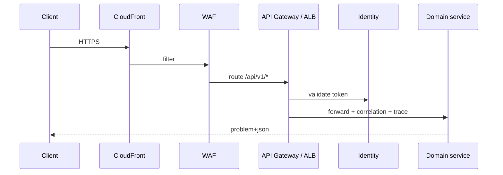

# 02 — API Gateway Platform

**Bounded context:** `platform.gateway`  
**Phase 1:** Unified edge for routing, auth, limits, tracing  
**National backbone:** Evolves into [Taifa Integration Platform (TIP)](../integration/00_PLATFORM_OVERVIEW.md) — enterprise & partner gateways, event bus, webhooks.

---

## Purpose & business value

One **front door** for all Taifa APIs: consistent auth, versioning, rate limits, OpenAPI, and correlation—reducing duplicate middleware in every Django app.

---

## Responsibilities

Routing · authentication (JWT/device) · authorization passthrough · rate limiting · request validation · API keys (partners) · OpenAPI aggregation · versioning · W3C trace context · **X-Correlation-Id** · edge caching (GET) · WAF integration.

**Not:** Business validation (domains) · ledger logic.

---

## Architecture

**Phase 1:** ALB + Django `RequestIDMiddleware` + DRF throttling; evolve to **API Gateway** HTTP APIs with VPC link to ECS.

---

## Microservices

Edge config service (routes, stages) — IaC in `infra/`; optional Lambda authorizer calling Identity.

---

## APIs

| Surface | Purpose |
| --- | --- |
| Public | `/api/v1/{domain}/...` |
| Platform meta | `/api/v1/platform/gateway/health` |
| Partner keys | `/api/v1/ecosystem/partners/*` (existing) |

OpenAPI: merged schema from drf-spectacular; spectral CI per [architecture/03](../architecture/03_API_STANDARDS.md).

---

## Events

`gateway.request.blocked` (rate/WAF) → Audit + Security Hub.

---

## Security

mTLS partners · API key HMAC · JWT validation at edge · request size limits · geo allowlist optional.

---

## AWS

**API Gateway** · **CloudFront** · **WAF** · **Shield** · **Route 53** · **ACM** certs.

---

## Scaling

CloudFront global; API GW throttling per key; ECS autoscale behind ALB.

---

## Monitoring

4xx/5xx by route, p99 latency, throttle count, WAF blocks — [09_MONITORING_PLATFORM.md](09_MONITORING_PLATFORM.md).

---

## Failure recovery

Multi-AZ ALB; stale OpenAPI rollback via previous ECS task definition.

---

## Roadmap

P1: correlation + trace headers mandatory · P2: API Gateway custom domain · P3: GraphQL BFF (read-only)
