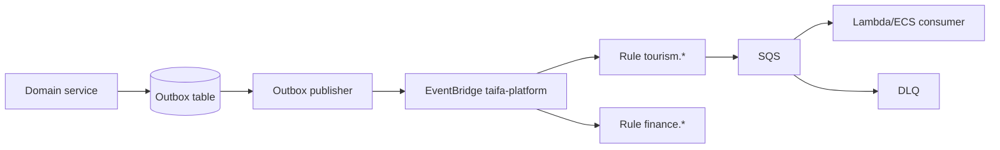

# 03 — Event Platform

**Bounded context:** `platform.events`  
**Phase 1:** National event bus with outbox, schemas, DLQ

---

## Purpose & business value

**Loose coupling** between Pay, Commerce, Tourism (later), Mobility: domains publish facts; consumers react idempotently—no shared DB writes.

---

## Responsibilities

Envelope standard · outbox relay · EventBridge bus · SNS fanout · SQS queues · DLQ · retry/backoff · schema registry · idempotency keys on consumers · versioning · canonical naming ([ADR-0002](../architecture/adr/0002-event-catalog-prefix-policy.md)).

---

## Architecture

---

## Microservices

`event-outbox-relay` (worker) · `event-schema-registry` (Glue/Schema) · `event-replay` (ops tool, future)

---

## Entities / VOs

**Entities:** `OutboxMessage`, `Subscription`, `DeadLetter`  
**VOs:** `EventEnvelope`, `EventId`, `SchemaVersion`, `CorrelationId`

---

## APIs

| Method | Path | Use |
| --- | --- | --- |
| POST | `/platform/events/publish` | Internal only (prefer outbox) |
| GET | `/platform/events/schemas/{name}` | Schema fetch |
| POST | `/platform/events/replay` | Ops (RBAC) |

---

## Events (meta)

`platform.event.published` · `platform.event.dlq.threshold` — platform telemetry.

---

## Database

`platform_outbox` (id, event_type, payload, status, created_at, published_at) — per publisher DB or shared platform schema.

---

## Idempotency & ordering

Consumers store `event_id`; partition key = aggregate id for ordered processing.

---

## Retry & DLQ

SQS maxReceiveCount=5, exponential backoff; DLQ alarm → SNS ops topic.

---

## AWS

**EventBridge** · **SQS** · **SNS** · **Lambda** (relay) · **CloudWatch** alarms.

---

## Security

IAM per publisher `events:PutEvents`; encrypt payloads with KMS for PII classes.

---

## Roadmap

M4 reference: `finance.payment.captured` on bus in staging ([14](14_PLATFORM_IMPLEMENTATION_GUIDE.md)).
