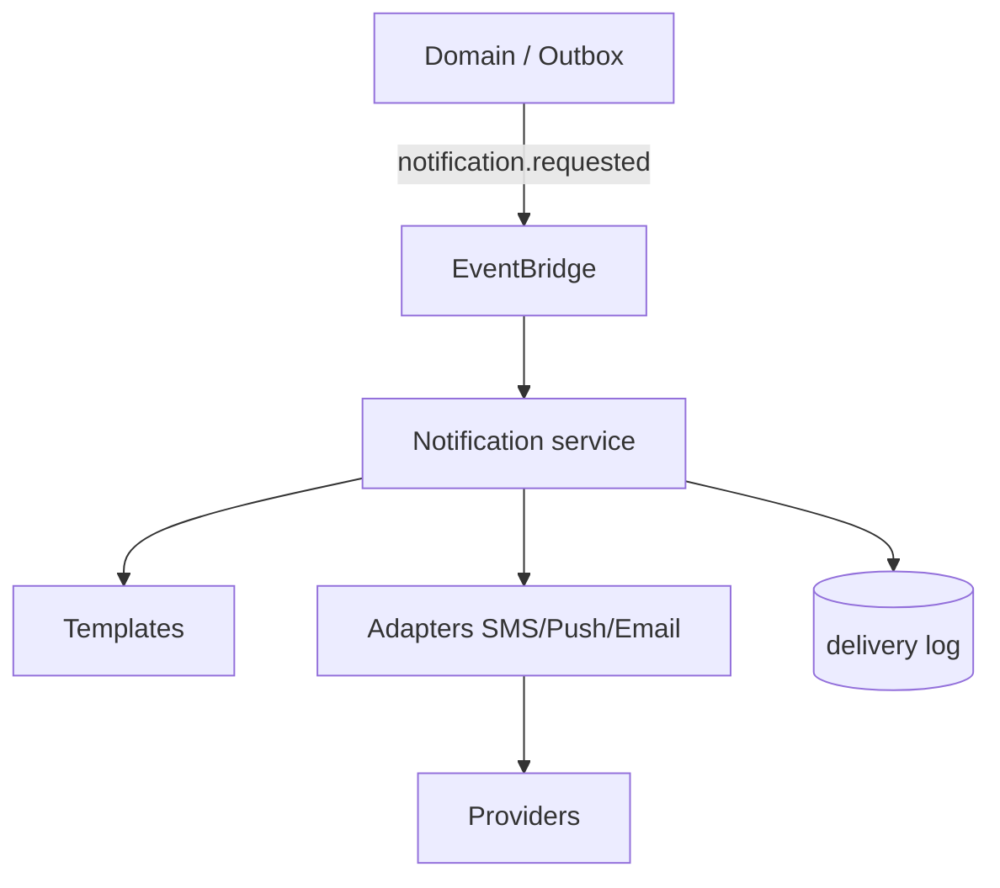

# 04 — Notification Platform

**Bounded context:** `platform.notifications`  
**Phase 1:** One delivery pipe for push, SMS, email, in-app

---

## Purpose & business value

Domains emit **notification intents**; platform handles templates, localization, provider adapters, retries, and delivery tracking—no per-domain SMS integrations.

---

## Responsibilities

Push · email · SMS · in-app inbox · templates · Kiswahili/English · scheduling · delivery webhooks · unsubscribe/consent — **not** business workflow state.

---

## Architecture

**Today:** `integrations.notifications` + `enterprise` outbox webhooks — consolidate behind `/api/v1/platform/notifications/`.

---

## Microservices

`notification-api` · `notification-worker` · `template-service`

---

## Entities

`NotificationRequest`, `DeliveryAttempt`, `Template`, `ChannelPreference`, `InAppMessage`

---

## APIs

| Method | Path |
| --- | --- |
| POST | `/platform/notifications/send` |
| GET | `/platform/notifications/{id}/status` |
| GET | `/platform/notifications/inbox` |
| POST | `/platform/notifications/templates` |

---

## Events

`notification.message.queued` · `notification.message.delivered` · `notification.message.failed`

---

## Database

`notification_request`, `notification_delivery`, `notification_template`, `notification_preference`

---

## Security

PII minimization in payloads; opt-in for marketing; rate limits per user.

---

## AWS

SQS workers · SES/SNS · optional Pinpoint · Secrets for provider keys.

---

## Scaling / monitoring / DR

Worker autoscale on queue depth; DLQ for failed deliveries; metrics: delivery rate, latency.

---

## Roadmap

WhatsApp channel · national SMS aggregator failover
