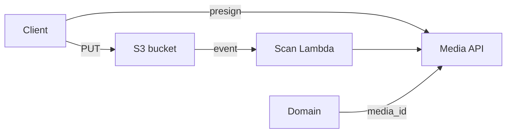

# 05 — Media Platform

**Bounded context:** `platform.media`  
**Phase 1:** Central object storage + metadata + scan pipeline

---

## Purpose & business value

Secure upload/download for **images, PDFs, passports, insurance docs, QR assets, profile photos**—virus scan, KMS encryption, signed URLs—domains store **media_id** refs only.

---

## Responsibilities

Upload presign · download authorize · metadata · virus scan hook · retention policies · CDN URLs — **not** document business rules (visa approval).

---

## Architecture

---

## Entities

`MediaObject`, `UploadSession`, `ScanResult`

---

## APIs

POST `/platform/media/uploads` (presign) · GET `/platform/media/{id}` · DELETE `/platform/media/{id}` (soft)

---

## Events

`media.upload.completed` · `media.scan.failed` · `media.deleted`

---

## Database

`media_object` (id, owner, bucket_key, mime, size, classification, scan_status)

---

## Security

KMS SSE-S3 or SSE-KMS; presign TTL; ABAC owner; malware block.

---

## AWS

**S3** · **CloudFront** (signed) · **Lambda** scanner · **Macie** (future)

---

## Roadmap

Video transcoding · WORM bucket for regulatory docs
