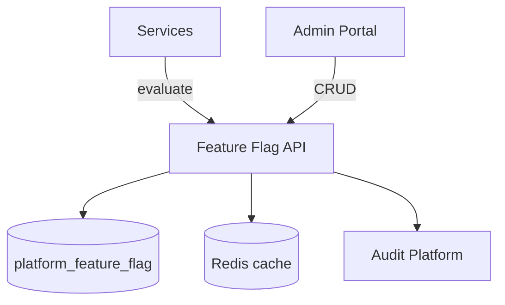
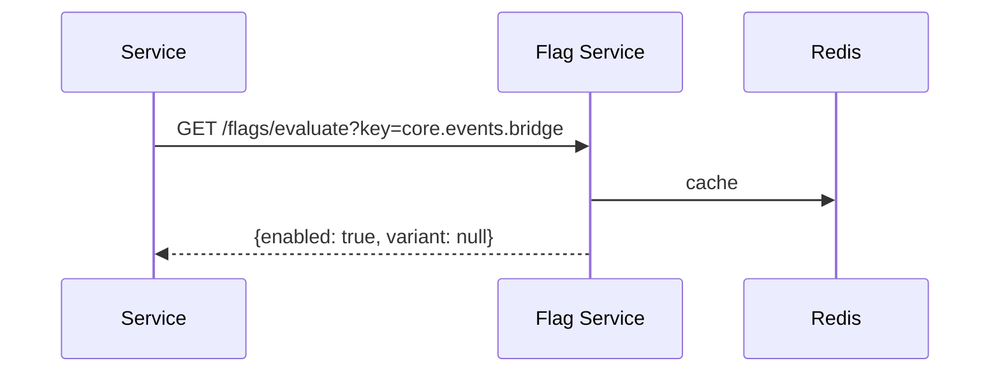
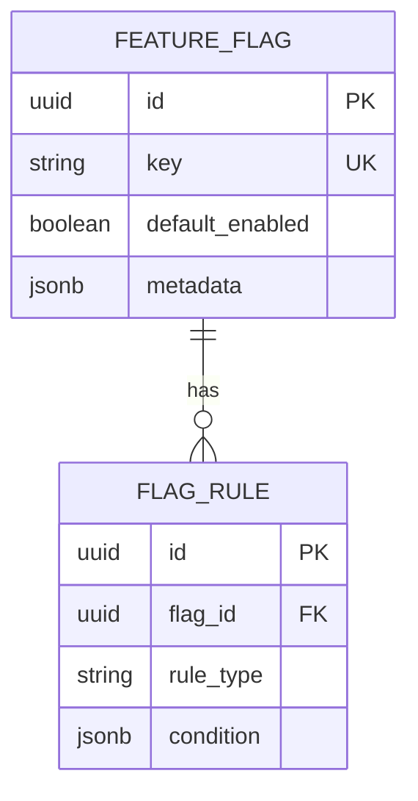

# 08 — Feature Flags Platform

**Bounded context:** `platform.featureflags`  
**Phase 1:** Centralized flags with audit trail and safe defaults

---

## Executive summary

Feature flags decouple **release** from **deploy** for Taifa Core and future domains: kill switches, gradual rollouts, and tenant experiments—without environment-specific code branches.

---

## Purpose & business value

| Stakeholder | Value |
| --- | --- |
| Platform | Safe rollout of Core services |
| Domains | Toggle modules per market without redeploy |
| Ops | Instant disable on incident |

---

## Responsibilities

| In scope | Out of scope |
| --- | --- |
| Flag CRUD (ops RBAC) | Business rules inside domains |
| Evaluation API (bool/json) | A/B analytics (→ Analytics) |
| Targeting (user %, tenant, market) | Permanent config (→ Configuration) |
| Audit on change | |

---

## Architecture

---

## Bounded context & microservices

- **Context:** `platform.featureflags`  
- **Services:** `feature-flag-api`, `feature-flag-evaluator` (can be one ECS service)

**Internal components:** Evaluator · Admin API · Cache invalidator · Audit hook

---

## Domain model

**Entities:** `FeatureFlag`, `FlagRule`, `FlagOverride`  
**Value objects:** `FlagKey`, `RolloutPercentage`, `MarketCode`, `TenantId`  
**Events:** `platform.flag.created` · `platform.flag.updated` · `platform.flag.evaluated` (sampled)

---

## API contracts

| Method | Path | Auth |
| --- | --- | --- |
| GET | `/api/v1/platform/flags/evaluate` | Service or user JWT |
| GET/POST/PATCH | `/api/v1/platform/flags` | Ops RBAC |
| GET | `/api/v1/platform/flags/{key}/audit` | Ops |

OpenAPI tag: `Platform - Feature Flags`. Versioning per [architecture/03](../architecture/03_API_STANDARDS.md).

---

## Database design (ER)

---

## Security model

Ops-only write; services read with IAM/mTLS; no PII in flag payloads; audit all changes.

---

## AWS services

ECS · RDS · ElastiCache · Secrets Manager (admin tokens)

---

## Deployment model

Sidecar or library in `taifa_platform/flags`; hot cache TTL 30s; fail **closed** for security flags, **open** for UX flags (document per flag).

---

## Scaling / failure / monitoring

Horizontally scale API; Redis for read volume; metrics: `flag_evaluations_total`, `cache_hit_ratio`; alert on evaluation errors.

---

## Operational runbooks

**Flag stuck on:** disable via admin · clear Redis key `ff:{key}` · verify audit log.

---

## Future enhancements

AppConfig integration · LaunchDarkly-style experiments · geo targeting

---

## Cross-references

[07_CONFIGURATION_PLATFORM.md](07_CONFIGURATION_PLATFORM.md) · [09_AUDIT_PLATFORM.md](09_AUDIT_PLATFORM.md)
