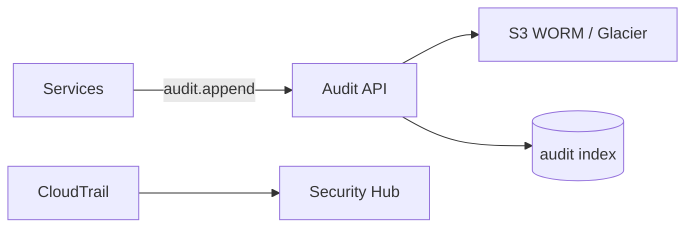

# 09 — Audit Platform

**Bounded context:** `platform.audit`  
**Phase 1:** Immutable activity & compliance log

---

## Purpose & business value

**Regulator-grade** evidence: who did what, when, on which resource—for money, identity, government, and security events.

---

## Responsibilities

Append-only audit API · user activity · security events · business event mirroring · export for compliance · **not** application debug logs (see Monitoring).

---

## Architecture

---

## Entities

`AuditRecord` (actor, action, resource_type, resource_id, correlation_id, payload_hash, occurred_at)

---

## APIs

POST `/platform/audit/records` (internal) · GET `/platform/audit/query` (RBAC ops)

---

## Events

`audit.record.appended` (to cold storage pipeline)

---

## Database

`audit_record` append-only; no UPDATE/DELETE (trigger).

---

## Security

Tamper-evident hashes; KMS; retention 7+ years metadata.

---

## AWS

S3 Object Lock · CloudTrail organization trail · integration with [11_SECURITY_PLATFORM.md](11_SECURITY_PLATFORM.md)

---

## Roadmap

SIEM export · citizen downloadable activity report (GDPR-style)
