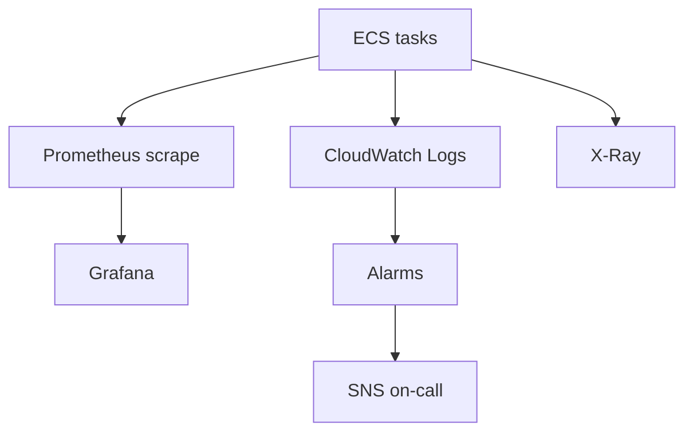

# 10 — Monitoring Platform

**Bounded context:** `platform.observability`  
**Phase 1:** Logs, metrics, traces, alerts, health

---

## Purpose & business value

**Operate Taifa Core** with golden signals, SLOs, and on-call runbooks—every service exposes `/healthz`, `/readyz`, Prometheus metrics, structured logs with `correlation_id`.

---

## Responsibilities

Structured logging schema · Prometheus `/metrics` · X-Ray tracing · CloudWatch dashboards · SNS alerts · synthetic canaries · SLO burn rates.

**Existing:** `RequestIDMiddleware`, `HttpMetricsMiddleware`, Sentry, Grafana JSON in repo.

---

## Architecture

---

## APIs

GET `/healthz` · `/readyz` · `/metrics` (platform standard)

---

## Log schema (mandatory fields)

`timestamp`, `level`, `message`, `correlation_id`, `service`, `trace_id`, `owner` (if present)

---

## AWS

**CloudWatch** · **X-Ray** · **Container Insights** · optional **AMP** (Managed Prometheus)

---

## Failure recovery

Alert runbooks in `docs/ONCALL.md`; composite alarms for payment + identity.

---

## Roadmap

OpenTelemetry unified SDK · SLO-as-code in IaC
