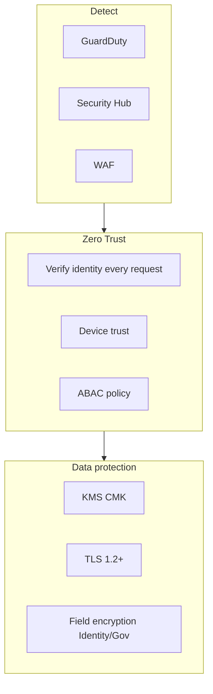

# 11 — Security Platform

**Bounded context:** `platform.security` (cross-cutting)  
**Phase 1:** Zero trust, encryption, compliance controls

---

## Purpose & business value

National-scale **trust**: PCI containment for Pay, ISO-aligned controls, automated threat detection—shared by all Core services.

---

## Responsibilities

Zero trust network · IAM roles per service · encryption at rest/transit · KMS · Secrets Manager · CloudTrail · GuardDuty · Security Hub · WAF · Shield · vulnerability scanning · PCI DSS scope documentation · ISO 27001 control mapping.

---

## Security model

---

## PCI DSS

Card data **only** in Pay adapters; no PAN in domain DBs; tokenization at gateway.

---

## ISO 27001 alignment

Map controls to [`governance/SECURITY_GOVERNANCE.md`](../governance/SECURITY_GOVERNANCE.md); annual review.

---

## AWS services

KMS · Secrets Manager · CloudTrail · GuardDuty · Security Hub · WAF · Shield Advanced (prod) · IAM · Config rules.

---

## Checkpoints per release

Threat model delta · dependency scan · IAM review · secrets scan (gitleaks).

---

## Roadmap

External pen-test · bug bounty · HSM for national ID
