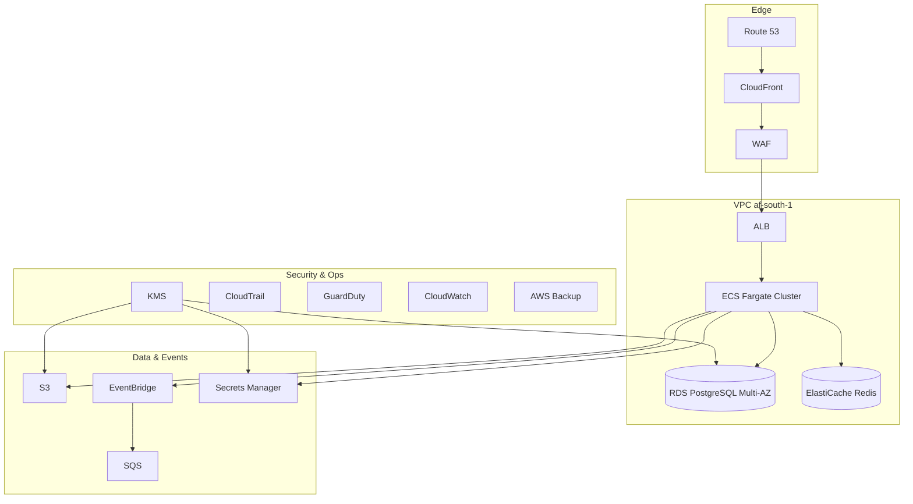

# 13 — Infrastructure Platform (IaC)

**Bounded context:** `platform.infrastructure`  
**Phase 1:** Production-ready AWS in `af-south-1`

---

## Purpose & business value

**Reproducible** national infrastructure: VPC, compute, data, bus, edge—no click-ops production.

---

## Deployment diagram



---

## Component mapping

| Component | AWS service |
| --- | --- |
| API edge | ALB (+ API Gateway phase 2) |
| Compute | ECS Fargate (web, worker, outbox-relay) |
| Async | Lambda (optional), Celery on ECS |
| OLTP | RDS PostgreSQL 15+ |
| Cache | ElastiCache Redis |
| Events | EventBridge custom bus `taifa-platform` |
| Queues | SQS + DLQ |
| Fanout | SNS (ops alerts) |
| Objects | S3 (+ CloudFront) |
| DNS | Route 53 |
| Crypto | KMS CMK |
| Secrets | Secrets Manager |
| Observability | CloudWatch, X-Ray |
| Security | WAF, Shield, GuardDuty, Security Hub |
| Backup | AWS Backup (RDS, S3) |

---

## Repository structure

```
infra/
├── modules/
│   ├── vpc/
│   ├── ecs/
│   ├── rds/
│   ├── redis/
│   ├── eventbridge/
│   ├── s3/
│   └── iam/
└── envs/
    ├── dev/
    ├── test/
    ├── staging/
    └── prod/
```

---

## Scaling

ECS CPU/memory autoscaling; RDS read replica when CPU &gt; 70%; Redis cluster mode at high session load.

---

## Failure recovery / backup

Multi-AZ RDS; RPO 5 min / RTO 1 h target; cross-region read replica (warm); quarterly restore drill.

---

## Environments

| Env | Account pattern | Purpose |
| --- | --- | --- |
| dev | non-prod | Engineer sandboxes, fast iteration |
| test | non-prod | CI integration and contract tests |
| staging | non-prod | Core integration |
| prod | prod | Citizens (later) |

---

## Roadmap

Multi-region active-passive · private link to government networks
